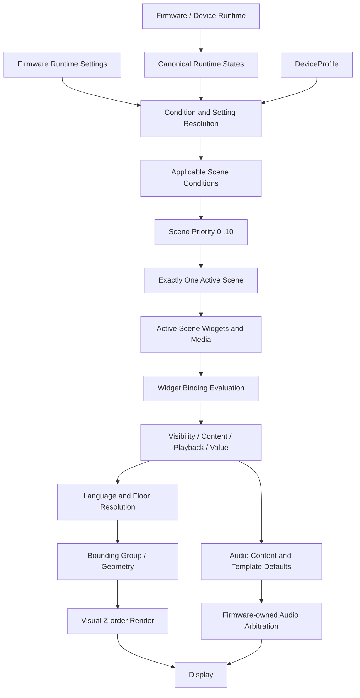

# Template Designer — Domain / Runtime Contract Audit V1

**Yazar:** Manus AI  
**Tarih:** 2026-08-18  
**Kapsam:** `manus2` branch kaynak dokümanları  
**Kısıt:** Bu audit sırasında uygulama kodu, UI implementasyonu, Phase 0 foundation kodu ve UI Design System değiştirilmemiştir.

> Bu belge, kaynak dokümanlarda zaten bulunan domain/runtime davranışlarını sistematikleştirir. Kaynakta kesinleşmeyen bir davranış ürün kararı olarak eklenmemiş; **MISSING DECISION** veya **CONFLICT** olarak işaretlenmiştir.

## 1. Executive Summary

Template Designer için temel domain fikri kaynaklarda yeterince nettir: **firmware/device profile runtime truth'tur; Designer ise bu verinin hangi görsel, metinsel ve işitsel içerikle sunulacağını tanımlar.** `State` ile `Scene` ayrımı, birden fazla state'in aynı anda aktif olabilmesi ve buna karşılık tek bir active Scene bulunması açık biçimde tanımlanmıştır. Widget binding'i aktif Scene içindeki görünürlük, içerik veya playback davranışını etkiler; Scene seçimini doğrudan değiştirmez. [1] [2] [3]

Buna karşın kaynaklar henüz tek ve makine tarafından doğrudan uygulanabilir bir runtime contract değildir. En kritik açıklar; **Project/Theme Project/Theme/Rotation/Form hiyerarşisi**, canonical runtime state ID'leri, Scene priority ile binding/condition priority arasındaki ilişki, aynı priority tie-break kuralı, Floor Mapping şeması, Media Slide/Media Sequence sınırı, format conversion sorumluluğu, eşzamanlı video sınırı, audio arbitration ve SD `config.cfg` alanlarıdır. Bu konularda kaynaklarda birden fazla ifade bulunduğu için karar verilmemiş noktalar sessizce birleştirilmemiştir. [4] [5] [6] [7]

### Audit kapsamı ve sayısal özet

Aşağıdaki sayılar, aynı konuya ilişkin tekrar eden ifadeler birleştirildikten sonra oluşturulan 57 maddelik audit durum kütüğüne dayanır. **SUPPORTED**, semantik kuralın kaynaklarda bulunduğu anlamına gelir; makine-okunabilir şemanın tamamlandığı anlamına gelmez. **PARTIALLY DEFINED** ve **MISSING** birlikte, kodlamaya başlamadan önce tamamlanması gereken eksik alanları ifade eder.

| Durum | Madde sayısı | Yorum |
|---|---:|---|
| `SUPPORTED` | 24 | Semantik davranış kaynaklarda yeterince belirgin. |
| `PARTIALLY DEFINED` | 20 | Ana ilke var; alan, cardinality, algoritma veya severity eksik. |
| `MISSING` | 3 | Kaynakta uygulanabilir bir karar/şema yok. |
| `CONFLICTING` | 10 | Kaynaklar aynı konuyu uyumlu olmayan biçimde ifade ediyor. |
| **Eksik veya tamamlanmamış toplam** | **23** | `PARTIALLY DEFINED + MISSING`. |

DeviceProfile alanları özelinde 15 kontrol noktasının **4'ü SUPPORTED**, **11'i PARTIALLY DEFINED** durumundadır. Hiçbir alanın yalnızca bir dosyada geçiyor olması, onun firmware tarafından kesinleştirildiği anlamına gelmez; gerçek profile/firmware sözleşmesi hâlâ dış kaynaktır. [3] [4] [5]

## 2. Domain Terminology

### 2.1 Canonical ayrımlar

| Kavram | Kaynaklardan çıkarılan anlam | Durum |
|---|---|---|
| **Project** | Editable çalışma alanı ve SD-card seviyesindeki deployment kapsamı; deployment package'ın kendisi değildir. | `SUPPORTED` |
| **Theme** | Ekran tasarımının editable domain nesnesi; scene, widget, bounding group ve theme defaults taşır. | `SUPPORTED` |
| **Theme Project** | Dört fiziksel form/rotation içeren gerçek tema paketi olarak UX arşivinde tanımlanır. | `CONFLICTING` |
| **Rotation / Form** | `r0`, `r90`, `r180`, `r270` ile ifade edilen bağımsız fiziksel geometriler. | `CONFLICTING` |
| **Scene** | Aktif runtime state/condition kümesinden priority kurallarıyla seçilen görsel sunum. | `SUPPORTED` |
| **State** | Firmware/DeviceProfile tarafından sağlanan runtime koşul veya değer. Birden fazlası aynı anda aktif olabilir. | `SUPPORTED` |
| **Widget** | Semantic görsel nesne; type, geometry, z-order, content/style ve binding taşır. | `SUPPORTED` |
| **Media** | Image/video/audio gibi içerik ve playback parametrelerini temsil eden genel medya kavramı. | `PARTIALLY DEFINED` |
| **Asset** | Stable ID, source/metadata ve media type taşıyan proje/deployment kaynağı. | `SUPPORTED` |
| **DeviceProfile** | Firmware capability, state/setting registry ve deployment sınırlarının kaynağı. | `SUPPORTED` |
| **Runtime State** | Cihazın o anda ne yaptığına ilişkin firmware verisi. | `SUPPORTED` |
| **Runtime Setting** | Teknisyenin firmware menüsünden değiştirebildiği ayar. | `SUPPORTED` |
| **Binding** | Runtime state/value/setting ile widget content, visibility, playback veya parametre çözümlemesini bağlayan domain mekanizması. | `SUPPORTED` |
| **Floor Mapping** | Firmware floor value'sunu proje gösterim değerine ve ilgili digit/style çözümlemesine taşıyan kural. | `PARTIALLY DEFINED` |
| **Bounding Group** | Widget olmayan, isteğe bağlı geometrik hizalama/composition yapısı. | `SUPPORTED` |
| **Design Rule** | Validation ve export kontrolü olarak tanımlanır; ancak ortak makine-okunabilir nesne şeması yoktur. | `MISSING` |
| **Deployment Package** | Editable project'ten derlenen, transport-independent ve doğrulanmış firmware teslim birimi. | `SUPPORTED` |

`State ≠ Scene` ayrımı kaynaklarda nettir. State firmware'den gelen runtime truth iken Scene, aktif state'ler arasından koşul ve priority çözümlemesiyle seçilen görsel durumdur. State'ler eşzamanlı olabilir; active Scene tektir. Warning'ler de state modelinin içindedir ve ayrı bir widget sınıfı olmak zorunda değildir. [3] [6] [7]

### 2.2 Hiyerarşi ve cardinality uyuşmazlığı

Kaynaklarda üç farklı model aynı anda bulunmaktadır. Architecture V2, `Project → Theme → Rotation → Scene → Widget` hiyerarşisini ve Theme Project'in dört rotation taşıdığını söyler. UX karar arşivi bunun üzerine `Project → Theme Project Group → Theme Project → Rotation[4]` katmanını ekler. Buna karşılık Domain Model `Project → Theme[]` yapısını kullanır; Template Schema ise Theme içinde `canvas/widgets/boundingGroups` tanımlar fakat rotation ve scene alanlarını açıkça serialize etmez. [4] [5] [15] [18]

Bu nedenle şu ayrım henüz canonical değildir: **Theme**, **Theme Project** ve **Theme Project Group** aynı nesnenin farklı adları mı, yoksa ayrı container'lar mı? Aynı şekilde **Rotation** ile **Form** eş anlamlı mı, yoksa bir rotation içinde ayrı form geometrileri mi vardır? Project'in kaç Theme/Theme Project taşıdığı da tüm kaynaklarda aynı değildir. Bu durum **CONFLICT** olarak korunmuştur; kaynaklardan biri seçilerek sessizce çözülmemiştir.

## 3. DeviceProfile Contract

DeviceProfile'ın temel görevi yalnızca UI filtrelemek değildir; firmware'in desteklediği içerik, runtime registry, format, çözünürlük, decode ve deployment sınırlarını Designer'a taşımaktır. Ancak gerçek firmware profile registry formatı, kesin medya codec listesi ve kesin deployment parser alanları henüz mevcut değildir. [3] [4] [6]

| Alan | Durum | Kaynak destekli sonuç |
|---|---|---|
| Display resolution | `SUPPORTED` | Dört form için `720×1280` ve `1280×720` örnekleri açıkça verilir; publish'te tüm formların geçerli olması gerekir. [3] |
| Rotations | `PARTIALLY DEFINED` | Dört fiziksel rotation/form ve profile-supported rotation fikri vardır; profile içindeki registry/schema ve cardinality tam değildir. [4] [18] |
| Scenes | `PARTIALLY DEFINED` | Profile-supported scenes ve otomatik başlangıç iskeleti tanımlanır; exact SceneDefinition ve required-scene listesi yoktur. [4] [18] |
| Runtime states | `SUPPORTED` | Firmware-owned registry, metadata, canonical ID ve simulator/binding tüketimi tanımlanmıştır. [6] |
| Runtime parameters | `PARTIALLY DEFINED` | Typed runtime values, parameters ve gelecekteki external parameters anılır; exact parameter registry ve precedence yoktur. [3] [8] |
| Media capabilities | `SUPPORTED` | Image/video/audio, sequence, video slots, playback ve decode capabilities profile sorumluluğundadır. [3] [4] |
| Supported formats | `PARTIALLY DEFINED` | Formatların profile'dan gelmesi kesindir; nihai image/video/audio format listesi ve codec/sample-rate alanları açık bırakılmıştır. [3] [14] [15] |
| Supported colors | `PARTIALLY DEFINED` | Default arrow styles için program palette'si desteklenir; palette kapsamı ve firmware color encoding'i açık değildir. [3] [10] |
| Video limitations | `PARTIALLY DEFINED` | Video slot/decode limitleri profile-defined'dır; `1280×720` toplam decode örneği yalnız bir kaynakta V1 örneği olarak geçer ve global canonical eşik değildir. [4] [10] |
| Audio capabilities | `PARTIALLY DEFINED` | Background, announcement, media/video audio ve volume kanalları ayrılır; mixer/ducking/arbitration kesin değildir. [4] [11] [13] |
| Floor data | `SUPPORTED` | Numeric ve symbolic floor values profile tarafından sağlanabilir; Designer gelen raw value'yu yeniden hesaplamaz. [4] [8] [13] |
| Language capabilities | `PARTIALLY DEFINED` | Supported languages profile'dan gelir; canonical language state ID, locale listesi ve font-language mapping açık değildir. [14] |
| Digit styles | `PARTIALLY DEFINED` | Default/custom style, symbol metadata ve missing-symbol validation tanımlıdır; exact style asset schema ve firmware formatı açık değildir. [3] [13] |
| Direction styles | `PARTIALLY DEFINED` | Default/custom, Up/Down varyantları ve palette/custom color davranışı tanımlıdır; exact style registry ve initial Down policy kesin değildir. [3] [12] |
| Deployment format | `PARTIALLY DEFINED` | Profile deployment formatın kaynağıdır; logical package ve SD `config.cfg` yapısı vardır, exact firmware parser alanları yoktur. [3] [16] |

## 4. Runtime State Contract

### 4.1 Ownership ve kapsam

**Runtime state'i Designer icat etmez.** State tanımı firmware/device profile registry'sine aittir; Designer yalnızca registry'yi okuyarak Properties, Binding, Simulator, Validation ve AI API yüzeylerini üretir. `Custom State` veya kullanıcı tanımlı runtime signal oluşturma özelliği kaynaklara göre bu aşamada yoktur. [6] [12]

Ham seri protokolü Designer domain'inin dışında tutulur. Beklenen dış sınır `raw bytes/bits/packets → firmware decoder → canonical runtime state` biçimindedir; Designer canonical state'i tüketir. ARKEL bit/byte mapping, UART frame, CRC veya gerçek serial parser bu audit kapsamındaki contract'ın parçası değildir. [6] [15]

### 4.2 State ailesi audit'i

| Davranış / örnek | Kaynaklarda görülen ifade | Durum |
|---|---|---|
| Fire | `fire`, yangın condition'ı ve yüksek priority örneği olarak geçer. | `SUPPORTED` |
| Overload | `overload` / `aşırı yük` olarak geçer; Registry dosyasında bir yerde görünmez karakter içeren yazım da vardır. | `SUPPORTED`, canonical spelling temizlenmeli |
| Service out | `service_out`, `service`, `servis_dışı` ve `service out` ifadeleri farklı dosyalarda kullanılır. | `CONFLICT` |
| Door opening/closing | Registry dört canonical door state önerir: `door_opening`, `door_open`, `door_closing`, `door_closed`. UI örneklerinde `Opening`/`Closing` kullanılır. | `PARTIALLY DEFINED` |
| Direction | Registry `up/down/idle`; diğer şema ve contract'larda `direction = up/down/none` veya `direction` enum'u görülür. | `CONFLICT` |
| Floor | Numeric ve symbolic typed runtime value'dur; Designer değeri hesaplamaz. | `SUPPORTED` |
| Warning | Genel `warning` yalnız profile sağlıyorsa kullanılabilir; fire/overload/service gibi semantic durumlar ayrı state olabilir. | `SUPPORTED` |
| Custom State | Kullanıcı state oluşturamaz; firmware registry source of truth'tur. | `SUPPORTED` |

Ayrıca `estop` bazı kaynaklarda alarm/security state olarak listelenirken Domain Model'deki “mevcut üç warning” listesi `service_out`, `overload`, `fire` ile sınırlıdır. Bu ifade, E-Stop'un runtime state olarak var olmasına engel değildir; ancak warning registry içindeki canonical üyeliği açık değildir. Bu konu `MISSING DECISION` olarak işaretlenmelidir. [5] [6] [12] [18]

### 4.3 State priority ile presentation priority

State tanımının kendisi priority taşımaz; Runtime State Registry priority'nin binding/condition/presentation üzerinde tutulabileceğini söyler. Scene Designer ise Scene priority'sini 0–10 aralığında tanımlar. Bu iki seviyenin birbiriyle nasıl birleştirileceği, Scene seçiminin binding priority'den önce mi sonra mı çalışacağı ve aynı state'in farklı widget/Scene'lerde farklı priority kullanmasının nasıl çözüleceği kaynaklarda tek bir algoritma olarak verilmemiştir. Bu nedenle **state priority ownership** bir **CONFLICT/MISSING DECISION** alanıdır; yeni bir değerlendirme sırası varsayılmamıştır. [6] [7] [12]

## 5. Scene Selection

### 5.1 Kaynak destekli model

Kaynakların ortak desteklediği model aşağıdaki gibidir:

```text
Birden fazla aktif runtime state
        ↓
Scene activation conditions
        ↓
Scene priority 0..10
        ↓
Tek active Scene
        ↓
Active Scene içindeki widget/content
        ↓
Widget-level condition/binding
        ↓
Visibility / content / playback resolution
        ↓
Bounding Group ve Z-order
```

Aynı runtime context'te birden fazla Scene applicable olabilir; yüksek priority'li Scene daha düşük priority'li Scene'in önüne geçer. Fire için `priority = 10` örneği, E-Stop/overload/service/door/movement için örnek değerler ve warning Scene davranışı verilir; fakat V2 contract bu değerlerin örnek olduğunu, nihai defaultların ayrıca kesinleştirilebileceğini belirtir. [3] [7]

### 5.2 Tie-break audit'i

Scene Questionnaire aynı priority'de runtime event ordering/tie-break sırasının kullanılacağını ve Scene document/list order'ın bunun kullanıcı tarafından anlaşılabilir yüzü olduğunu söyler. Aynı konu Product Decisions ve V2 contract'ta henüz nihai karar olarak açık bırakılmıştır. Dolayısıyla `later state wins`, `document order wins` veya başka bir deterministic kural burada canonical karar olarak yazılmamıştır. Bu doğrudan **CONFLICT** durumudur. [3] [7] [12]

### 5.3 Scene, widget binding ve Z-order ayrımı

Scene condition, Scene'in active olup olmadığını belirler. Widget condition ise Scene active olduktan sonra ilgili widget'ın gösterilmesini veya davranışını belirler. Widget binding'i Scene seçimini değiştirmez. Scene priority, widget Z-order ve Bounding Group geometrisi üç ayrı eksendir. Fire Scene active olduğunda o Scene'in kendi Up arrow widget'ı varsa arrow görünür; warning Scene'in active olması yalnızca “tüm normal widget'lar zorunlu olarak gizlenir” şeklinde genel bir kural üretmez. [7] [8] [9]

Media Slide playback'inin bitmesi de otomatik olarak başka Scene'i active yapmaz; Scene seçim source'u runtime state ve priority'dir. [10]

## 6. Binding Contract

Binding, firmware runtime value/state ile Widget, Media, Digit veya Direction arasında kurulan presentation bağlantısıdır. En açık desteklenen örnekler şunlardır: `Floor == 6`, `Door == Opening`, `Fire == true`, `Floor == 6 AND Door == Opening` ve `NOT Fire`. Condition'lar DeviceProfile-defined type/operator bilgisine göre AND/OR/NOT veya expression tree ile birleştirilebilir. [4] [8]

| Binding yüzeyi | Kaynak destekli davranış | Durum |
|---|---|---|
| Media | Show/hide, play/pause/stop/restart/continue ve media selection. | `SUPPORTED` |
| Digit/Floor | Floor value ve mapping sonucuna göre gösterim/style/media seçimi. | `SUPPORTED` |
| Direction | Up/Down varyantı, style/media selection ve none/hidden. | `SUPPORTED` |
| Text | Runtime condition, localized content ve `{FloorNumber}` gibi parameter substitution. | `SUPPORTED`, expression kapsamı kısmi |
| Background, warning, door animation ve diğer semantic widgets | Generic condition/content binding örnekleri vardır; her widget için action/property matrisi yoktur. | `PARTIALLY DEFINED` |

Binding actions type-dependent'dır. Image-like içerikler için visibility/selection, media widget'ları için `Show`, `Hide`, `Play`, `Pause`, `Stop`, `Restart`, `Continue` kaynakta açıkça bulunur. Her widget property'sini arbitrary runtime mutation ile değiştiren genel bir mekanizma tanımlanmamıştır. [8]

Parametric binding için `{FloorNumber}` açıkça desteklenen/önerilen bir yaklaşım olarak geçer. `{residents}` gibi CSV veya external data parametreleri ise yalnız geleceğe dönük extension point'tir; V1 için zorunlu uygulama değildir. Bu nedenle generic parameter registry ve expression type system **MISSING DECISION** durumundadır. [8] [10]

Invalid binding için kaynak destekli validation kontrolleri unknown state, invalid datatype comparison, unsupported operator, invalid value, unresolved parameter ve invalid floor mapping reference'tır. Invalid reference'ın sessizce silinmemesi, unresolved olarak görünür kalması gerekir. [8]

## 7. Floor Mapping

Floor data yalnız decimal integer değildir. Kaynaklarda `-2`, `-1`, `0..11` ve firmware tarafından sağlanabilecek `K`, `P`, `R`, `Z`, `F`, `T` gibi symbolic değerler yer alır. Exact value set DeviceProfile tarafından ilan edilmelidir. Designer gelen floor değerini yeniden numaralandırmaz veya kendi kurallarıyla başka bir kata dönüştürmez. [4] [8] [12] [13]

Kaynak destekli minimum zincir şöyledir:

```text
Firmware Value
      ↓
Project / Theme Floor Mapping
      ↓
Display Value
      ↓
Digit representation / selected Digit Style
      ↓
Renderer
```

Örnek olarak `-2 → P2`, `-1 → P1`, `0 → G`, `1 → 1`, `2 → 2` mapping'leri verilir. Mapping project-specific presentation/configuration kuralıdır ve deterministic, firmware-readable biçimde export edilmelidir. Bir mapping özel Digit Style seçebilir; özel style yoksa uygulanabilir default Digit Style kullanılır. [4] [8]

Ancak mevcut Template Schema'da bağımsız bir `FloorMappingDefinition` nesnesi yoktur; mapping çoğunlukla condition ve style örnekleri içinde dolaylı görünür. Display Value'ın string/typed value modeli, locale-specific mapping, mapping'in scope'u ve export alanı açık değildir. Bu nedenle minimum domain fikri **SUPPORTED**, makine-okunabilir contract ise **MISSING** durumundadır.

## 8. Digit / Direction

### 8.1 Digit

Digit/Floor widget firmware'den gelen floor state'i gösterir; `0–9` ile sınırlı olmayan symbol setlerini, default digit style'ı, custom digit style'ı, mapping sonucunu ve gerektiğinde localized representation'ı kullanabilir. Digit style'ın desteklediği semboller metadata ile ilan edilmeli ve eksik sembol validation tarafından raporlanmalıdır. [3] [5] [13] [14]

Digit style, Direction style'dan ayrıdır. Direction'daki Up/Down varyant mantığı Digit için geçerli değildir. Normal text için glyph atlas zorunlu değildir; text firmware font referansı kullanır. [3] [12] [15]

### 8.2 Direction

Direction runtime `up`, `down` veya `none/hidden` sonucunu gösterir. Default style'da shape ve profile/program palette'si seçilebilir; Up ve Down varyantları bağımsız olarak değiştirilebilir. Custom style'da Up ve Down ayrı asset reference'larıdır; Custom Up seçildiğinde Down otomatik olarak oluşturulmaz ve custom asset'e Designer palette rengi uygulanmaz. [3] [12] [15]

Default style için Product Decisions, Down'ın başlangıçta Up seçimini kopyalayabileceğini fakat sonradan bağımsız değiştirilebileceğini söyler. V2 contract bu bağımsızlığı doğrular ancak kopyalamanın zorunlu mu yoksa yalnızca başlangıç UX'i mi olduğunu kesinleştirmez. Bu yüzden kullanıcı tarafından ayrıca sorulan “UP seçilince DOWN default varyantının otomatik oluşturulması” kararı **PARTIALLY DEFINED** durumundadır; custom davranış ise nettir. [3] [12]

## 9. Bounding Groups

Bounding Group opsiyonel bir layout/composition yapısıdır; widget değildir, runtime priority değildir ve Z-order değildir. Arrow + Digit gibi birden fazla widgetı veya runtime'da değişen genişlikteki içeriği ortak geometrik referansa göre hizalar. Fixed Slots modunda görünmeyen child'ın slotu korunur; Dynamic Active Items modunda yalnız aktif child'lar layout'a dahil edilir ve tekrar ortalanır. [9]

Kaynakta 1, 2, 3, 4 ve 5 active item için merkezleme örnekleri vardır: tek child kendi merkeziyle, iki child ortak geometrik merkezle, üç child ortadaki child ile, dört child 2 ve 3 arasındaki merkezle, beş child 3. child referansla hizalanır. Genel ifade geometrik merkezin referansa denk getirilmesidir. [5] [9]

Bu davranışın minimum contract'ı desteklenmektedir; ancak şu noktalar kesin bir algoritma değildir: 5'ten fazla child, farklı child genişlikleri, spacing'in ölçü birimi ve ekseni, görünürlük değişiminin layout'a hangi anda yansıdığı, nested group ve child ordering. Bu alan **PARTIALLY DEFINED** bırakılmalıdır. Kaynakta klasik anchor-to-anchor graph'ın kullanılmayacağı açıkça belirtilmiştir; eski `WIDGETS_AND_MEDIA.md` ise anchor sistemi tanımlar. V2 kararları esas alınsa bile eski dosyanın repository'de tutulması bir dokümantasyon conflict'idir. [3] [9] [17]

## 10. Media

Media ile Widget Type ayrı kavramlardır. Media; image, video ve audio içeriklerinin yanı sıra duration, loop, repeat count, playback, volume ve profile-defined capability metadata'sını taşıyabilir. Direction, Digit/Floor, Background veya Media Slide semantic widget'ları uygun profile desteklediğinde image/video content kullanabilir; Video yalnızca `Video` isimli widget'a hapsedilmez. [3] [4] [10]

Duration için 0.1 saniye precision tanımlıdır. Media Slide dışındaki bağımsız medya için default duration `0` yani uygulanabilir durumda indefinite; Media Slide içindeki medya için default `3.0 s` olarak verilir. Loop sonsuz tekrar, Repeat ise sayılı tekrar anlamındadır ve birbirinden ayrıdır. [4] [10]

### Media conversion conflict

V2 contract temel resize/fit/crop ve profile'a göre image/video/audio hazırlama ihtiyacını, örneğin `Image → ARGB8888`, `Video → MJPEG AVI`, `Audio → WAV`, ve conversion tamamlanmadan publish yapılmamasını anlatır. Buna karşılık Media/Asset Browser ve UX karar arşivi V1 Designer'ın full format conversion yapmayacağını; MP4→AVI, JPEG→başka format, WAV dönüşümü ve ARGB888 conversion'ın ayrı Format Tool kapsamı olduğunu söyler. Bu iki ifade aynı anda uygulanabilir bir sorumluluk sınırı vermediği için **CONFLICT** olarak kaydedilmiştir. [3] [10] [17]

V1 için kesin olan, kaynak asset ile firmware hedef asset'in aynı şey sayılamayabileceği ve validation'ın gereken hedef çıktının varlığını kontrol etmesi gerektiğidir. Hangi işlem Designer içinde, hangisi Format Tool içinde yapılacak sorusu çözülmeden publish pipeline contract'ı tamamlanmış sayılmamalıdır.

## 11. Media Slide

Kaynakların büyük bölümü Media Slide'ı **tek bir görsel media content'i** (`image` veya `video`) ve isteğe bağlı audio, duration, loop/repeat, condition ve visual layer alanları olan bir yapı olarak tanımlar. Aynı Scene içinde birden fazla Media Slide bulunabilir ve DeviceProfile'ın eşzamanlı medya/decode kapasitesi izin verdiği sürece birden fazla slide aynı anda aktif olabilir. Bir slide'ın playback'inin bitmesi active Scene'i değiştirmez. [5] [10] [11]

Media Slide'ın kata özel içerik için Popup yerine kullanılması nettir: `floor == 5 → customer_5.jpg`, yüksek visual layer ve isteğe bağlı audio ile normal Media Slide oluşturulur. Popup veya Floor Popup ayrı bir domain nesnesi değildir. [3] [11] [15]

Bununla birlikte iki model birlikte geçmektedir:

| Model | Kaynaklardaki ifade | Audit sonucu |
|---|---|---|
| Tek media + attached audio | Domain Model, Product Decisions ve Media Layering. | `SUPPORTED` ana model |
| Timeline/sequence | `Media Sequence` ayrı semantic widget olarak V2 contract'ta; eski widget contract'ında her item için duration, repeat, audio binding/policy bulunur. | `CONFLICT` / canonical sınır eksik |
| Audio'nun timeline item'ı olması | Kullanıcı promptunda denetlenmesi istenir; güncel kaynaklar audio'yu çoğunlukla attached channel olarak gösterir. | `MISSING DECISION` |

Bu nedenle “Media Slide içindeki image/video/audio öğelerinin timeline'ı” için kaynak destekli minimum ifade, **aynı Scene'de birden fazla slide ve slide başına görsel media + attached audio** biçimindedir. Image/video/audio'nun tek bir ortak timeline item modeline dönüştürülmesi kaynaklarda kesinleşmiş bir karar değildir. [3] [5] [10] [17]

Media continuity opsiyoneldir: uyumlu size/playback özellikleri varsa kullanıcı tarafından açılabilir; yeni Scene geometry'si kullanılır. Bu davranış implicit guarantee değildir. [4] [8] [10]

### Simultaneous video limit

`MEDIA_ASSET_BROWSER_QUESTIONNAIRE_V1.md`, V1 hedef cihaz için aynı anda toplam video decode çözünürlüğünün `1280×720` sınırını aşmasının validation warning/error üretmesi gerektiğini örnekler. Architecture ve diğer contract'lar ise simultaneous decode limitinin DeviceProfile tarafından belirleneceğini söyler; Product Decisions nihai format/capability listesini açık bırakır. Bu nedenle `1280×720` repository içinde görülen bir **profile/example candidate**'dır; tüm DeviceProfile'lar için kesin global limit değildir. [4] [10] [12]

## 12. Audio

Kaynaklar en az üç audio katmanını ayırır: **Background Music**, **Announcement/Voice** ve **Media/Video Audio**. Background Music Theme-level ve loop/persistent davranışlıdır; Scene-level normal override değildir. Background + announcement, background + media ve background + announcement + media kombinasyonları kavramsal olarak desteklenir. Audio repeat count, video loop count'tan bağımsızdır. [4] [10] [11] [13]

Firmware settings tarafında announcement language/voice pack, announcement volume, background music volume/enable ve benzeri ayarlar ayrıca firmware-owned olabilir. Designer template defaultları hazırlayabilir; firmware saha ayarları runtime değer olarak üstün gelebilir, fakat precedence'in kesin kuralı firmware contract'a bırakılmıştır. [12] [13]

### Audio priority ve arbitration conflict

Architecture V2 ve Media/Asset questionnaire audio priority için `0–100` aralığı ve configured ducking/override kurallarını anlatır. Buna karşılık Product Decisions ve Media Layering belgeleri gerçek runtime audio arbitration/mixing davranışının firmware sorumluluğunda olduğunu ve Designer'ın bunu yeniden tasarlamayacağını belirtir. Bu ifadeler “Designer yalnız default policy metadata mı taşır, yoksa 0–100 priority ve ducking rule'larını gerçekten export eder mi?” sorusunu cevaplamaz. **Audio priority 0–100'ün ownership ve export etkisi CONFLICT/MISSING DECISION'dır.** [4] [10] [11] [12]

Ducking, override, mute, video audio + external audio mix ve üçlü channel arbitration için yalnız örnek davranışlar vardır; exact mixer/interrupt/precedence algoritması yoktur. Bu nedenle Designer'ın Preview/Simulator'ında firmware'in gerçek arbitration'ını yeniden uyguladığı iddia edilmemelidir. [11] [13]

## 13. Localization

Runtime language UI language'dan ayrıdır ve firmware/device profile tarafından belirlenebilir. Language resolution; text, announcement audio, video/media variants, floor display ve gerektiğinde digit style/content üzerinde etkili olabilir. Dil widget'ın kendisi değil, content resolution boyutudur. [12] [14]

Language 1 / Language 2 announcement modeli kaynaklarda sıralı playback olarak yer alır; örneğin seçilen iki dilin audio content'i peş peşe oynatılabilir. Tek dil veya çoklu dil tema kapsamı seçilebilir. Ancak şu konular kesin değildir: canonical runtime language ID, selected language setting'in registry biçimi, tek/çift dilin firmware field'ları, fallback'in her content türündeki uygulanma sırası, font-language mapping, locale-specific floor representation ve audio interrupt davranışı. [10] [13] [14]

Fallback için `Requested: fr → Available: tr, en → Fallback: en` örneği vardır; fakat fallback'in profile mı, theme'e mi, content'e mi ait olduğu ve missing content'in export'ta ERROR mu WARNING mi olacağı belirlenmemiştir. Bu yüzden localization semantiği **SUPPORTED**, tam runtime contract ise **PARTIALLY DEFINED** durumundadır.

## 14. Assets / Resources

Asset ownership ve görünürlük ayrımı kaynaklarda ayrıntılıdır.

| Alan | Kaynak destekli anlam | Export sonucu |
|---|---|---|
| **Asset Depot / Asset Browser** | Yeniden kullanılabilir kütüphane/depo görünümü; kendisi export kaynağı değildir. | Depodaki her asset otomatik gitmez. |
| **Theme Resources** | Projenin/Theme'in sahip olduğu dosya/asset kaynakları; widget veya Scene container'ı değildir. | Export rules kapsamındaki gerekli kaynaklar gider. |
| **Scene asset/reference** | Scene/object hiyerarşisinde kullanılan asset referansı; scene ile ilişkisi görünür. | Kullanılıyorsa dependency olarak dahil edilir. |
| **Unsupported Files** | Desteklenmeyen dosyaların ayrı yönetim/debug alanı. Widget veya normal asset olamaz. | Normal export edilmez. |
| **Default/Profile Assets** | DeviceProfile'ın sağladığı varsayılan kaynaklar. | Yalnız referanslanmış/gerekli olanlar dahil edilir. |
| **Used Assets** | Project/Theme tarafından gerçekten referanslanan kaynaklar. | Export kapsamına girer. |

“Scene içine yerleştirilen asset scene-owned, Resources asset project resource” ayrımı ownership ile reference'ı birbirine karıştırmamalıdır. Kaynaklar Scene kullanımının Scene/object reference olarak görünmesini destekler; fiziksel asset ownership'in her durumda Scene'e devredildiğini kesinleştirmez. Bu nedenle raporda **scene-owned** ifadesi yalnız “Scene'e bağlı referans” anlamında kullanılmıştır. [4] [10] [18]

Asset stable ID'si display name ve filename'dan bağımsızdır. Aynı asset rotation-specific değildir; rotation kullanımı Scene/widget reference'ında tutulur. Aynı exported package içinde stable ID'ler unique olmalıdır; farklı Theme/package namespace'lerinde duplicate local ID'ler scope ile ayrılabilir. Rename, replace veya filename değişimi stable ID'yi değiştirmez. [10] [18]

Asset Browser, Resources, scene references, used assets ve Unsupported Files arasındaki ayrım **SUPPORTED**'dır. Exact firmware folder names, color coding ve final export manifest reference formatı ise **PARTIALLY DEFINED**'dır. [10] [18]

## 15. Deployment

Editable Project ile firmware deployment package ayrıdır. Kaynak proje doğrudan SD karta kopyalanmaz; önce validate → required asset resolution → package build → integrity/checksum → verification pipeline'ından geçirilir. Package transport-independent olmalı; V1 SD Card Adapter aktif, gelecekteki Wi-Fi target ayrıştırılmış olmalıdır. Verification tamamlanmadan deployment success gösterilemez. [1] [2] [16]

### Deployment katmanları

| Katman | Kaynak destekli rol | Durum |
|---|---|---|
| Project | Editable source/workspace; project/theme/widget/media verisini tutar. | `SUPPORTED` |
| Theme / Theme Project | Deployment kapsamındaki görsel tema ve form/rotation yapısı. | `PARTIALLY DEFINED` |
| Rotation / Form | Dört fiziksel geometri; publish için tamamının geçerli olması gerekir. | `PARTIALLY DEFINED` |
| Scene | Runtime condition/priority ile seçilen görsel presentation. | `SUPPORTED` |
| Resources / assets | Gerekli ve referanslanan normalized/target resources. | `SUPPORTED` |
| `manifest` / package metadata | Package/version identity, theme/layout/assets/integrity bilgisinin logical taşıyıcısı. | `PARTIALLY DEFINED` |
| Root `config.cfg` | SD genel bilgileri ve theme index. | `PARTIALLY DEFINED` |
| Theme `config.cfg` | İlgili Theme içeriği. | `PARTIALLY DEFINED` |
| Stable IDs / asset refs | Deterministic internal references; absolute Windows path kullanılamaz. | `SUPPORTED` fakat scope kısmi |

Repository'de iki farklı abstraction seviyesi vardır. `DEPLOYMENT_FORMAT.md` `theme.pkg/manifest.json/theme.json/layout.json/assets/checksum` yapısını **logical example** olarak verir ve firmware parser iddiasında bulunmaz. V2 Contract ve Product Decisions ise SD'de root `config.cfg` ile Theme başına `config.cfg` içeren fiziksel görünümü verir; kesin parser alanlarının firmware sözleşmesiyle ayrıca belirleneceğini söyler. Bu, doğrudan çelişkiden çok **logical package → SD filesystem mapping'inin eksik** olmasıdır. [3] [12] [16]

Stable ID'lerin assetler için davranışı belirgindir; ancak Project, Theme, Rotation, Scene, Widget, Media ve package manifest stable ID kapsamlarının hepsi aynı ayrıntıyla tanımlanmamıştır. Asset ID'lerinin immutable olması, firmware reference'larının hangi namespace/version ile saklanacağı ve duplicate/replace işleminin manifest'e nasıl yansıyacağı ayrıca makine-okunabilir hale getirilmelidir.

## 16. Validation

Validation; editor, simulator, save, export ve console tarafından paylaşılan first-class bir service olmalıdır. Critical validation error veya failed package verification deployment'ı bloklar; kullanıcı success durumunu verification öncesinde göremez. [4] [16]

| Kontrol konusu | Kaynak destekli sonuç | Severity durumu |
|---|---|---|
| Unsupported media / format mismatch | Profile capability ile karşılaştırılır; unsupported dosya normal asset/export değildir; referenced unsupported content raporlanır. | Exact `ERROR/WARNING` matrisi eksik |
| Missing asset / missing resource | Validation ve export design rule olarak açıkça vardır. | Normalde blocking aday; severity canonical değil |
| Invalid binding | Unknown state, datatype, operator, value, parameter ve mapping reference kontrol edilir. | Blocking koşulunun kesin listesi yok |
| Invalid floor mapping | Invalid mapping reference ve eksik symbol/style kontrol edilir. | Severity ve fallback eksik |
| Device capability violation | Widget/media/format/language/font/style/video/audio capability kontrol edilir. | Unsupported capability'nin her case severity'si yok |
| Simultaneous video limit | DeviceProfile decode limitine göre kontrol edilir; 1280×720 örneği vardır. | Global mi profile-specific mi kesin değil |
| Missing required scene/rotation | Dört form/rotation bütünlüğü açık; required Scene listesi ve silinen Scene'in etkisi açık değil. | Rotation daha net, Scene severity eksik |
| Invalid configuration | Schema version, profile, references, package/config integrity kontrol edilir. | Exact config schema yok |
| Duplicate IDs / illegal group membership | Widget duplicate ID, stable ID uniqueness ve cyclic group membership kontrol edilir. | Kural destekli |
| Incomplete conversion / target output | Bazı kaynaklar publish öncesi conversion ister; V1 Format Tool ayrımıyla çelişir. | `CONFLICT` |

Kaynaklarda `ERROR` ve `WARNING` kavramları kullanılır; ancak ortak `ValidationSeverity` enum'u veya hangi koşulun export'u kesin olarak durduracağı tam tablo halinde yoktur. **Unsupported referenced media, missing asset, invalid binding, invalid mapping, capability violation, simultaneous decode overflow ve config invalidity için profile-aware severity matrix gereklidir.** [3] [4] [8] [10] [15] [16]

## 17. Runtime Data Flow

Aşağıdaki akış, kaynakların gerçekten desteklediği ortak seviyede tutulmuştur. Ham serial protocol ve firmware audio arbitration Designer'ın canonical domain akışına dahil edilmemiştir.



Bu diyagramda `DeviceProfile` state/setting types, operators, capabilities ve validation sınırlarını sağlar. `Scene Priority` active Scene'i seçer; widget binding'i yalnız active Scene içinde çözülür. `Language and Floor Resolution` selected content ve digit representation'ı belirler; Floor raw value Designer tarafından yeniden hesaplanmaz. `Bounding Group` geometriyi, `Z-order` çizim sırasını belirler. Audio content/defaults Designer modelinden gelir; gerçek mix/ducking/interrupt sonucu firmware/runtime audio engine'e aittir. [3] [5] [6] [8] [11] [14]

## 18. Machine-readable Contract Candidates

Aşağıdaki tablo yeni kod değildir; mevcut kaynakların ileride JSON/TypeScript gibi bir contract'a dönüştürülebilecek kavramsal sınırlarını gösterir. **Required/Optional** sütunu profile-aware'dır: Profile desteklemiyorsa ilgili alanın proje içinde bulunması beklenmez.

| Candidate | Required / Optional | Owner / scope | Kaynakta şu an desteklenen minimum alanlar | Durum ve açık nokta |
|---|---|---|---|---|
| `DeviceProfile` | `REQUIRED` project reference; profile document runtime'da yüklenir. | `DEVICE-DEFINED` | id/version, display, supported widgets/media/formats, states, settings, languages, fonts, styles, audio/video/decode capabilities, validation/deployment constraints. | `PARTIALLY DEFINED`; exact profile registry schema yok. |
| `RuntimeStateDefinition` | `REQUIRED` profile-supported states için. | `DEVICE-DEFINED` / `RUNTIME-DEFINED` | id, displayName, description, type, category, unit?, enumValues?, defaultValue?, simulatorSupport, bindingCapabilities. | `SUPPORTED`; canonical IDs/registry file format eksik. |
| `RuntimeSettingDefinition` | `OPTIONAL`, yalnız profile ilan ederse. | `DEVICE-DEFINED` / `RUNTIME-DEFINED` | id, displayName, type, options, default/persistence, affectedCapabilities. | `PARTIALLY DEFINED`; setting registry ve precedence eksik. |
| `Project` | `REQUIRED`. | `PROJECT-DEFINED` | id, schemaVersion, name, profile reference, theme references, asset refs, metadata. | `SUPPORTED`; Theme cardinality conflictli. |
| `ThemeProject` / `Theme` | `REQUIRED` deployment tema yapısında; exact container sınırı açık değil. | `PROJECT-DEFINED` / `THEME-DEFINED` | id/name, forms/rotations, scenes, widgets, resources, defaults, localization, audio defaults. | `CONFLICTING`; Theme vs Theme Project vs Group ayrımı çözülmeli. |
| `Rotation` / `FormDefinition` | V2 form modelinde `REQUIRED` dört form; profile-supported rotation modelinde cardinality profile-aware. | `THEME-DEFINED` with `DEVICE-DEFINED` resolution | id, orientation, resolution, independent geometry/document data. | `PARTIALLY DEFINED`; Rotation/Form eşitliği ve schema eksik. |
| `SceneDefinition` | `REQUIRED` her tanımlı presentation için; exact required list profile-aware. | `SCENE-DEFINED` / `THEME-DEFINED` | id/name, activation conditions, priority 0..10, rotation/form relation, enabled, widget refs/order. | `PARTIALLY DEFINED`; tie-break, cardinality ve required scenes açık değil. |
| `WidgetDefinition` | `REQUIRED` her kullanılacak widget için. | `SCENE-DEFINED` | id/name, widgetType, enabled, geometry, zIndex, style/content refs, bindings, type-specific properties. | `PARTIALLY DEFINED`; form/scene override ve canonical widget registry schema eksik. |
| `BindingDefinition` | `OPTIONAL`; runtime davranışı gerekiyorsa. | `RUNTIME-DEFINED` source + `SCENE-DEFINED` / `PROJECT-DEFINED` presentation | sourceType/sourceId, expression/conditions, operator/value, action, priority, content/style/media refs. | `PARTIALLY DEFINED`; scene priority ile binding priority ilişkisi eksik. |
| `FloorMappingDefinition` | `OPTIONAL`; mapping gerektiren profile/theme için. | `DEVICE-DEFINED` input + `PROJECT-DEFINED` / `THEME-DEFINED` mapping | firmwareValue, displayValue, digitStyleRef?, locale?, asset/style refs. | `MISSING`; ayrı schema ve export alanı yok. |
| `MediaDefinition` | `REQUIRED` referenced media için. | `PROJECT-DEFINED` asset with `DEVICE-DEFINED` capability | stable asset ref, mediaType, format metadata, duration, loop/repeat, playback, volume, audio ref. | `PARTIALLY DEFINED`; conversion responsibility and format registry open. |
| `MediaSlide` / `MediaSequence` | `OPTIONAL`; profile sequence capability'sine bağlı. | `SCENE-DEFINED` with `RUNTIME-DEFINED` conditions | visual media, duration, loop/repeat, attached audio/repeat, condition, zIndex, optional continuity. | `CONFLICTING`; one-media slide ile timeline sequence sınırı net değil. |
| `BoundingGroup` | `OPTIONAL`. | `THEME-DEFINED` / `SCENE-DEFINED` | id, reference, geometry, alignment, spacing, layoutMode, children. | `PARTIALLY DEFINED`; arbitrary-N geometry and nested groups open. |
| `LocalizationBundle` | `OPTIONAL`; selected languages/content varsa. | `DEVICE-DEFINED` language registry + `THEME-DEFINED` content | supported languages, localized strings/assets, fallback, runtime language reference. | `PARTIALLY DEFINED`; fallback/locale/state IDs open. |
| `AudioRule` / `RuntimeDefaults` | `OPTIONAL`; profile capability'sine bağlı. | `DEVICE-DEFINED` runtime settings + `THEME-DEFINED` defaults | channel assets, repeat, volume defaults, background music, language variants, priority/ducking metadata. | `CONFLICTING`; Designer ownership vs firmware arbitration open. |
| `DesignRuleDefinition` | Validation service için `REQUIRED` kavramsal yüzey; rule set profile/project-aware. | `DEVICE-DEFINED` + `PROJECT-DEFINED` | rule id, severity, scope, diagnostic, remediation, exportBlocking. | `MISSING`; ortak rule schema/severity matrisi yok. |
| `DeploymentManifest` | `REQUIRED` verified package içinde. | `DEVICE-DEFINED` / `PROJECT-DEFINED` package contract | package/version identity, project/theme/rotation/scene refs, assets, config refs, integrity/checksum. | `PARTIALLY DEFINED`; exact manifest, cfg fields and SD mapping open. |

Bu adaylar bir implementation planı değil, mevcut dokümanlardan çıkarılabilen contract sınırlarıdır. Özellikle `FloorMappingDefinition`, `DesignRuleDefinition` ve exact `DeploymentManifest` için kaynaklar henüz yeterli bir serialization contract sunmamaktadır.

## 19. Confirmed Decisions

Aşağıdaki kararlar kaynaklar arasında yeterli ortaklıkla desteklenmektedir:

| Kesinleşen karar | Contract etkisi |
|---|---|
| Firmware/device profile runtime truth'tur. | Designer state icat etmez; profile registry tüketir. |
| `Custom State` yoktur. | Kullanıcı veya AI yalnız mevcut firmware-defined state'lere bağlanabilir. |
| State ve Scene farklıdır. | Birden fazla state aktif olabilir; active Scene tektir. |
| Scene selection priority ile yapılır; priority 0–10 aralığındadır. | Priority ile Z-order/Bounding Group ayrı tutulur. |
| Widget binding Scene selection'ı doğrudan değiştirmez. | Scene condition ve widget condition ayrı evaluation yüzeyleridir. |
| Widget type ile media type ayrıdır. | Semantic widget uygun image/video/audio content taşıyabilir. |
| Popup ayrı bir domain widget'ı değildir. | Kata özel içerik Media Slide + floor condition + visual layer ile modellenir. |
| Floor değeri Designer tarafından hesaplanmaz. | Numeric/symbolic firmware value mapping'e input olur. |
| Floor Mapping özel Digit Style seçebilir. | Özel style yoksa applicable default style kullanılır. |
| Custom Direction Up/Down ayrı assetlerdir. | Custom Up, Down'u otomatik üretmez; custom color palette uygulanmaz. |
| Bounding Group opsiyoneldir. | Geometry/alignment, runtime priority ve Z-order'dan ayrıdır. |
| Media duration precision 0.1 saniyedir. | Normal media default `0`; Media Slide default `3.0 s` olarak kaynaklanır. |
| Audio kanalları kavramsal olarak ayrıdır. | Background/announcement/media-video audio birlikte modellenebilir. |
| Asset stable ID name/filename'dan bağımsızdır. | Rename/replace ID'yi değiştirmez; package içinde uniqueness gerekir. |
| Unsupported Files normal widget/resource/export akışına girmez. | Export yalnız referenced/required/default kaynakları içerir. |
| Editable Project doğrudan SD karta kopyalanmaz. | Validate → build → integrity → verify → deploy pipeline'ı gerekir. |
| Preview, Simulator, Validation ve Export ortak canonical model tüketmelidir. | İkinci, basitleştirilmiş runtime rule engine oluşturulmamalıdır. |

## 20. Missing Decisions

Aşağıdaki konular kaynaklarda soru, örnek veya extension point olarak bulunmakla birlikte kodlanabilir final karar değildir:

| Öncelik | MISSING DECISION | Neden kritik |
|---:|---|---|
| 1 | `Project`, `Theme Project Group`, `Theme Project`, `Theme`, `Rotation` ve `Form` cardinality/hiyerarşisi. | Editable schema, editor navigation ve deployment manifest aynı nesne ağacını kullanamaz. |
| 2 | Canonical runtime state/setting registry formatı ve ID alias policy'si (`service`/`service_out`, `direction`, door naming). | Binding, simulator, validation ve firmware reference'ları farklı isimlere ayrılır. |
| 3 | Scene priority, binding/condition priority ve runtime event priority'nin evaluation sırası. | Active Scene ve widget content sonucu deterministic olamaz. |
| 4 | Aynı Scene priority'de kesin tie-break ve aynı Z-order'da deterministic drawing order. | Runtime ve render sonuçları nondeterministic kalır. |
| 5 | `FloorMappingDefinition` şeması, typed Display Value, locale etkisi ve export representation. | Floor Mapping Editor ile Digit renderer arasında makine-okunabilir köprü yoktur. |
| 6 | DeviceProfile'ın gerçek JSON/registry şeması ve version/compatibility modeli. | Capability-aware validation ve profile-driven UI güvenilir biçimde kurulamaz. |
| 7 | Designer ile Format Tool arasında conversion ownership ve target artifact lifecycle. | Publish'in hedef dosya hazır olma şartı ile V1 scope çelişmektedir. |
| 8 | Media Slide ile Media Sequence'in canonical sınırı; audio'nun attached channel mı timeline item mı olduğu. | Schema, playback, export ve simulator aynı modeli kullanamaz. |
| 9 | Simultaneous video decode limitinin profile alanı, çözünürlük toplama kuralı ve `1280×720` örneğinin scope'u. | Validation threshold yanlış profile'a uygulanabilir. |
| 10 | Audio priority 0–100, ducking/override/mute ve video+external audio mix'in Designer'da mı firmware'de mi temsil edileceği. | Preview/simulator ile gerçek firmware davranışı arasında yanlış eşdeğerlik kurulabilir. |
| 11 | Runtime language canonical ID, language 1/2 semantics, fallback precedence ve locale-specific floor/digit rules. | Localized content eksikliği ve runtime çözümlemesi deterministik değildir. |
| 12 | Bounding Group arbitrary-N geometri, variable width, spacing units, nested groups ve visibility timing. | Simulator ve ileride firmware renderer aynı layout'ı üretemeyebilir. |
| 13 | Stable ID namespace'inin asset dışındaki Project/Theme/Rotation/Scene/Widget/Media nesnelerine uygulanması. | Duplicate/rename/reference migration davranışı tamamlanmaz. |
| 14 | Logical package'ın root/theme `config.cfg` ve gerçek SD folder mapping'i; manifest/checksum alanları. | Package builder firmware tarafından okunabilir bir teslim üretemez. |
| 15 | Validation severity matrix: hangi `ERROR`, hangi `WARNING`, hangi warning ile export confirmation mümkün? | Publish gate ve kullanıcı remediation akışı belirsiz kalır. |
| 16 | Profile-supported Scene/rotation silme, restore ve required-content davranışı. | “Missing required scene/rotation” kontrolünün neyi blokladığı belirlenemez. |

## 21. Conflicts

| ID | Conflict | Çelişen kaynak ifadeleri | Audit durumu |
|---|---|---|---|
| C1 | Project/Theme Project/Theme/Rotation/Form hiyerarşisi | Architecture V2 doğrudan Theme→Rotation der; UX arşivi Theme Project Group ekler; Domain Model Theme[] kullanır; Template Schema rotation/scene alanlarını taşımaz. [4] [5] [15] [18] | Canonical hierarchy seçilmemeli; karar gerekli. |
| C2 | Canonical state ID'leri | `service_out`, `service`, `servis_dışı`; `up/down/idle` ile `direction=up/down/none`; door display labels ile canonical IDs karışır. [5] [6] [12] [15] | Registry/alias contract gerekli. |
| C3 | Priority ownership | Scene priority 0–10 Scene selection için tanımlı; Runtime Registry priority'yi binding/condition presentation'a bağlar. [6] [7] [12] | Evaluation order ve scope çelişkili/eksik. |
| C4 | Same-priority tie-break | Scene Questionnaire event ordering/list order yüzeyi verir; V2 Contract ve Product Decisions exact tie-break'i açık bırakır. [3] [7] [12] | Deterministic kural karar verilmemiş. |
| C5 | Media format conversion | V2 Contract conversion ve conversion tamamlanmadan publish'i anlatır; Media Asset/UX docs V1 full conversion'ı Format Tool'a bırakır. [3] [10] [17] | Responsibility boundary conflict. |
| C6 | Media Slide vs Media Sequence | Güncel model slide başına image/video + attached audio der; ayrı Media Sequence ve eski per-item timeline/audio policy modeli de bulunur. [3] [5] [10] [17] | Canonical playback schema eksik. |
| C7 | Simultaneous video limit | Asset questionnaire `1280×720` örneğini V1 hedefi olarak verir; diğer kaynaklar limiti DeviceProfile-defined ve nihai capability'yi open bırakır. [4] [10] [12] | Global limit olarak kullanılmamalı. |
| C8 | Audio priority/arbitration | Architecture/Asset docs 0–100 priority ve configured ducking anlatır; Product Decisions/Media Layering gerçek arbitration'ı firmware'e bırakır. [4] [10] [11] [12] | Designer export ownership net değil. |
| C9 | Default Direction Down initialization | Product Decisions başlangıçta Up seçimini kopyalayabileceğini söyler; V2 Contract bağımsız Up/Down'ı söyler fakat otomatik kopyalamayı zorunlu kılmaz. [3] [12] | UX başlangıç davranışı kesin değil; custom davranış nettir. |
| C10 | Legacy anchors/canonical scenes vs V2 generic model | Eski `WIDGETS_AND_MEDIA.md` anchor graph ve sabit canonical scenes içerir; V2 Contract klasik anchor'ı kaldırdığını ve runtime eventleri ayrı widget sınıfına çevirmediğini söyler. [3] [17] | V2 canonical kabul edilse dahi repository dokümanları drift içindedir; eski varsayımlar açıkça archival yapılmalı. |

## 22. Recommended Next Architecture Step

Phase 1 kodlamasına geçmeden önce yeni UI veya implementation kodu yazmak yerine tek bir **Contract Freeze Pack** hazırlanmalıdır. Bu pack aşağıdaki sıralı çıktılardan oluşmalıdır:

1. **Canonical hierarchy sheet:** Project, Theme Project Group, Theme Project, Theme, Rotation/Form, Scene ve Widget cardinality'si tek diagram ve tek JSON envelope ile sabitlenmelidir.
2. **DeviceProfile registry schema:** State, Setting, language, format, media/decode, audio, floor, digit, direction ve validation capability alanları versioned bir profile contract'a taşınmalıdır.
3. **Runtime resolution table:** Scene condition/priority, binding condition/action/priority, same-priority tie-break, Z-order tie-break ve media continuity sırası tek evaluation tablosunda gösterilmelidir.
4. **Floor and presentation schema:** `FloorMappingDefinition`, typed floor value, Display Value, Digit Style ve Direction Style reference'ları açıkça serialize edilmelidir.
5. **Media/audio boundary:** Media Slide, Media Sequence, attached audio, timeline item, format conversion, simultaneous decode ve audio arbitration sorumlulukları Designer/Firmware/Format Tool olarak ayrılmalıdır.
6. **Deployment manifest contract:** Logical package'ın root/theme `config.cfg`, manifest, stable IDs, asset references, resources ve checksum alanlarına nasıl dönüştüğü örnek bir canonical package ile sabitlenmelidir.
7. **Validation severity matrix:** Her rule için `ERROR`, `WARNING`, `INFO`, `exportBlocking` ve remediation formatı tanımlanmalıdır.

Bu adım ürün kararı icat etmek değildir; mevcut dokümanlarda zaten bulunan fakat farklı dosyalara dağılmış kararları tek, versioned ve profile-aware bir contract haline getirme adımıdır. Contract freeze tamamlanmadan UI form alanlarını veya runtime engine'i kodlamak, özellikle state ID, priority, media conversion ve deployment format konularında yeniden çalışma riski yaratır.

### Phase 1 öncesi kritik ve kritik olmayan konular

| Öncelik | Çözülmesi gereken konular |
|---|---|
| **Kritik** | Hiyerarşi/cardinality; canonical state/setting IDs; Scene/binding priority; same-priority tie-break; DeviceProfile schema/version; Floor Mapping schema; Media Slide/Sequence sınırı; format conversion ownership; video decode limit; audio arbitration boundary; deployment manifest/config mapping; validation severity. |
| **Kritik olmayan veya ertelenebilir** | Asset Browser badge ve preview ayrıntıları; Scene thumbnail; AI console komutlarının isimleri; gelecekteki CSV/external parameter kaynağı; renk klasörlerinin deterministik isimlendirmesi; optional dynamic active-item UX; UI language ve dock-layout ayrıntıları. |

## References

[1]: https://github.com/Huseyincansagir/Template_Designer/blob/manus2/AGENTS.md "Template Designer — Agent Contract"
[2]: https://github.com/Huseyincansagir/Template_Designer/blob/manus2/Template%20Designer%20%E2%80%94%20Ana%20Proje%20Geli%C5%9Ftirme%20Promptu.md "Template Designer — Ana Proje Geliştirme Promptu"
[3]: https://github.com/Huseyincansagir/Template_Designer/blob/manus2/docs/TEMPLATE_DESIGNER_CONTRACT_V2.md "Template Designer — Ürün, Widget ve Tema Sözleşmesi v2"
[4]: https://github.com/Huseyincansagir/Template_Designer/blob/manus2/docs/ARCHITECTURE_V2_APPLICATION_SHELL_DOMAIN_EDITOR.md "Template Designer — Architecture V2"
[5]: https://github.com/Huseyincansagir/Template_Designer/blob/manus2/docs/DOMAIN_MODEL_V1.md "Template Designer — Domain Model V1"
[6]: https://github.com/Huseyincansagir/Template_Designer/blob/manus2/docs/RUNTIME_STATE_REGISTRY.md "Runtime State Registry"
[7]: https://github.com/Huseyincansagir/Template_Designer/blob/manus2/docs/SCENE_DESIGNER_QUESTIONNAIRE_V1.md "Scene Designer — UX Questionnaire V1"
[8]: https://github.com/Huseyincansagir/Template_Designer/blob/manus2/docs/BINDING_PARAMETRIC_SYSTEM_V1.md "Binding & Parametric System V1"
[9]: https://github.com/Huseyincansagir/Template_Designer/blob/manus2/docs/BOUNDING_GROUP_LAYOUT.md "Bounding Group Layout"
[10]: https://github.com/Huseyincansagir/Template_Designer/blob/manus2/docs/MEDIA_ASSET_BROWSER_QUESTIONNAIRE_V1.md "Media / Asset Browser — UX Questionnaire V1"
[11]: https://github.com/Huseyincansagir/Template_Designer/blob/manus2/docs/MEDIA_LAYERING_AUDIO_AND_FLOOR_CONTENT.md "Media Layering, Audio ve Kata Özel İçerik"
[12]: https://github.com/Huseyincansagir/Template_Designer/blob/manus2/docs/PRODUCT_DECISIONS_2026-08.md "Template Designer — Consolidated Product Decisions"
[13]: https://github.com/Huseyincansagir/Template_Designer/blob/manus2/docs/FIRMWARE_PRESENTATION_SETTINGS.md "Firmware Presentation Settings"
[14]: https://github.com/Huseyincansagir/Template_Designer/blob/manus2/docs/MULTILINGUAL_CONTENT_SYSTEM.md "Template Designer — Multilingual Content System"
[15]: https://github.com/Huseyincansagir/Template_Designer/blob/manus2/docs/TEMPLATE_SCHEMA_V1.md "Template Designer — Template Schema V1"
[16]: https://github.com/Huseyincansagir/Template_Designer/blob/manus2/docs/DEPLOYMENT_FORMAT.md "Deployment Package Format"
[17]: https://github.com/Huseyincansagir/Template_Designer/blob/manus2/docs/WIDGETS_AND_MEDIA.md "Template Designer — Widgets, Medya ve Tema Sözleşmesi"
[18]: https://github.com/Huseyincansagir/Template_Designer/blob/manus2/docs/UI_UX_DECISIONS_V1.md "Template Designer — UI/UX Decisions V1"
