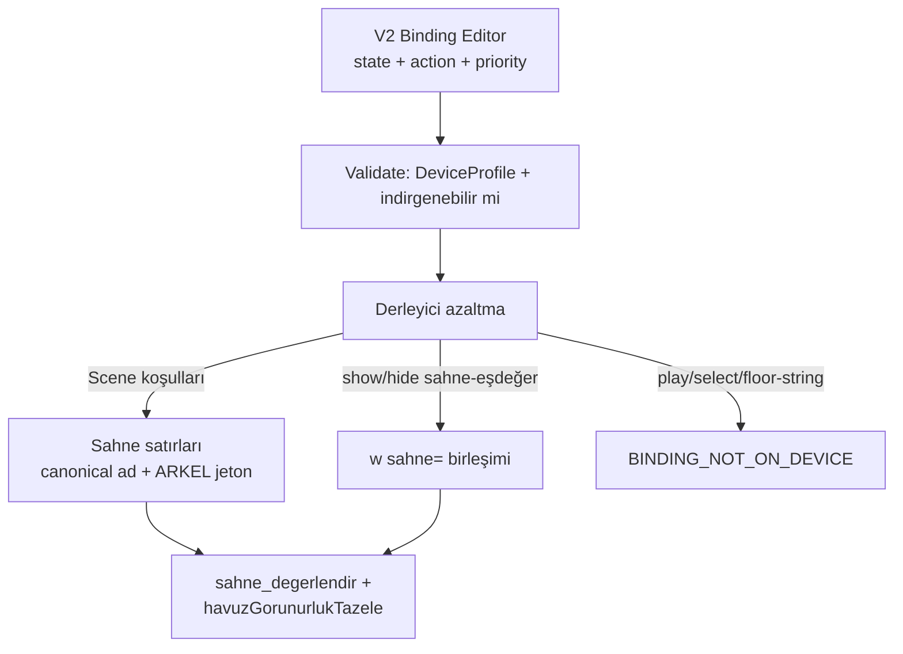

# Binding yapısı — nasıl kurulur (V2 ↔ MyApplication_6)

**Tarih:** 2026-08-19  
**Kapsam:** araştırma. Ürün/firmware C yazılmaz.  
**Kaynak:** `Template_Designer/src/Domain/models.ts`, `src/Core/runtime.ts`, `src/App/App.tsx`; `MyApplication_6/CM7/Core/Src/sahne_motoru.c`, `Screen1View.cpp` `havuzGorunurlukTazele`.

---

## 1. Sonuç (önce bu)

MyApplication_6’da **Binding diye bir parser yok.** Cihazda üç katman var; V2 Binding bunlardan yalnız birine (ve kısmen ikincisine) derlenir.

```text
ARKEL 12 bayt          →  MyApplication_6 decoder (Designer görmez)
        ↓
Sahne seçimi           →  tema.cfg `sahne` satırları  (Scene)
        ↓
Widget görünür / oyna  →  tema.cfg `w … sahne=`        (üyelik)
        ↓
Widget içi eylem       →  YOK (V2 Binding’in play/select-content kısmı)
```

**Kurulum kuralı:** Binding’i MCU’ya JSON olarak taşıma. Kullanıcı Binding’i canonical **runtime state** ile yazar; derleyici onu **sahne üyeliğine** çevirir. Çevrilemeyen Binding yayınlanmaz.

İkinci bir “binding” kelimesi firmware’de var: `varlik <ad> : <dosya>` — bu **dosya yolu tablosu**, V2 Binding değil. Karıştırma.

---

## 2. V2’de Binding nedir (kod)

`models.ts`:

```text
Binding
  id, widgetId
  conditions[]     DeviceProfile state/setting  (fire, floor, door_state, …)
  conditionMode    all | any
  action           show|hide|play|pause|stop|restart|continue|select-content|select-style
  contentId?
  priority         0–15  (Scene.priority 0–10’dan bağımsız)
```

Değerlendirme (`runtime.ts`):

1. `selectActiveScene` — sahne koşulları, yüksek `Scene.priority`, eşitlikte son aktif.
2. `evaluateBinding` — Binding koşulları aynı `conditionMatches` ile.
3. Preview (`App.tsx` ~2286): eşleşen Binding’ler **öncelik artan** sıralanır, sonra üzerine yazılır → **yüksek priority kazanır**; eşitlikte belge sırası.

Koşul: `equals / not-equals / greater-than / less-than / contains` + `negated`. State kullanıcı icat etmez; `DeviceProfile.runtimeStates` listesinden seçilir. ARKEL biti UI’da yok.

PC’de bu çalışır. Karta **yazılmaz** (`export.ts` Binding’i ayrı dosya yapmaz; rotation JSON içinde gömülü kalır, MCU okumaz).

---

## 3. MyApplication_6’da karşılığı (kod)

### 3.1 Sahne motoru

`sahne_degerlendir(m, p[12], kat)` her UART çerçevesinde RAM’de koşar (SD yok).

Koşul jetonları (`jeton_kosul`): yalnız

| Jeton | Anlam |
|---|---|
| `bN&maske` | veri baytı N AND maske ≠ 0 |
| `bN=değer` | bayt eşit |
| `kat=` `kat<` `kat>` `kat!=` | çözülmüş kat, `strtol` int |

Bilinmeyen jeton **düşer**. Satırdaki bütün jetonlar düşünce `kosul_n==0` → kural **varsayılan sahne** olur (yangın fail-open riski). Bu yüzden `state=fire` **yazılmaz**.

Aynı ada birden çok `sahne` satırı = OR. Bir satırda birden çok jeton = AND (`SAHNE_KOSUL_MAX=4`). Debounce `SAHNE_ONAY_N=3`.

Öncelik cihaz tablosundan (yangın 100, boşta 0) — V2 UI 0–10 **cihaza yazılmaz**.

### 3.2 Widget görünürlüğü — Binding’in gerçek hedefi

`havuzGorunurlukTazele` her kare:

1. Menü açıksa her şey gizli.
2. ARKEL verisi yoksa digit/arrow gizli (uydurma kat yok).
3. `sahne_tanim_gorunur(w, sahne_ad)`: widget `sahne=` listesinde seçili sahne var mı.
4. Alarm sahnesinde liste **boş** ise gizle (fail-closed).
5. Video: okuyucu açık **ve** `sahne=` uyumu; aksi halde pause+gizle (assert/donma yolağı).

Yani cihazda “Binding show/hide” = **`sahne=` listesinde olmak**. Play/pause ayrı action değil: görünür ⇒ play, gizli ⇒ pause.

### 3.3 Canlı veri Binding değildir

Kat rakamı ve yön oku Binding ile seçilmez. `updateDigits` / ok bitmap ARKEL kat/yön’den gelir. Overlay Binding’i bunları ezmemeli.

---

## 4. Üç katman — karıştırma

| Katman | Soru | V2 nerede | MyApplication_6 |
|---|---|---|---|
| A. Sahne | Hangi sunum aktif? | `Scene.activationConditions` | `sahne` satırı + ARKEL jeton |
| B. Üyelik | Bu widget bu sahnede durur mu? | Widget’ın hangi `Scene.widgets` içinde olduğu | `w … sahne=yangin,bosta` |
| C. Sahne-içi Binding | Aktif sahnede ne yapsın? | `Widget.bindings` | **yok** |

Bugün V2 kullanıcısı A ile C’yi karıştırabiliyor: `bosta` sahnesindeki widget’a `fire==true → show` Binding’i. Cihazda yangın sahnesi ayrıdır; widget yangının `sahne=` listesinde değilse **yanmaz**. Derleyici bunu ya sahneye ekler ya yayın keser — sessiz “preview’da vardı cihazda yok” olmaz.

---

## 5. Nasıl kurulur (önerilen)



### 5.1 Kullanıcıya üç yüzey (tek Binding kelimesi değil)

1. **Sahne etkinleştirme** — “Bu sahne ne zaman açılsın?”  
   Preset: yangın, aşırı yük, kapı açık, seyir yukarı, boşta.  
   Bit yok. Derleyici tabloya bakar.

2. **Sahne üyeliği** — widget o sahnenin tuvalinde duruyorsa üyedir.  
   Ağaç/sahne sekmesi yeter. Ayrı “her sahnede görünür” checkbox’ı üyeliği kopyalar.

3. **Binding (sahne-içi)** — yalnız aktif sahnede ek kural.  
   V1: show/hide **yalnız** canonical sahne state’ine indirgenebiliyorsa kabul (aslında üyeliğe çevir).  
   play / select-content / `floor contains Restaurant` → kırmızı Validate.

Böylece Preview ile cihaz aynı kuralı görür: Preview’da da üyelik + sahne seçimi; Binding efektleri cihazın yapmadığı şeyi göstermez (veya “cihaza gitmez” rozeti).

### 5.2 Canonical state → sahne adı (tek tablo)

MyApplication_6 `scene_contract.py` silindi; tablo git geçmişinde / bu belgede kopyalanır. V2 `DeviceProfile` **kopya JSON** taşır, ikinci tablo icat etmez.

| Canonical sahne | Cihaz `oncelik` | Jeton (AND) | V2 state (örnek) |
|---|---:|---|---|
| yangin | 100 | `b3&0x20` | `fire == true` |
| yangin | 100 | `b7=3` | aynı sahne, ikinci satır = OR |
| asiri_yuk | 90 | `b3&0x10` | `service_state == overload` |
| servis_disi | 70 | `b5&0x04` | `service_state == service_out` |
| kapi_ac | 60 | `b4&0x01` | `door_state == open` |
| kapi_kapa | 50 | `b4&0x02` | `door_state == closing` |
| seyir_yukari | 40 | `b5&0x10` | (profilde travel_up yok — **eklenmeli**) |
| seyir_asagi | 40 | `b5&0x20` | travel_down |
| bosta | 0 | *(boş)* | koşulsuz varsayılan |
| estop | — | **yok** | V1 `sahne estop` **yazılmaz** |

`foundationDeviceProfile` bugün `travel_up` / `idle` / `estop` taşımıyor. Binding Editor yangın/servis/kapı/kat dışında seyir Binding’i **sunmamalı**; sunarsa derleyici eşleyemez.

### 5.3 Show/hide → `sahne=` algoritması (V1)

Girdi: flatten edilmiş widget (`ad` ≤15, tek geometri).

```
liste = { canonicalName(S) | widget S.widgets içinde }

her Binding B (öncelik azalan, sonra belge sırası):
  eğer B.action ∉ {show, hide}:  BINDING_NOT_ON_DEVICE
  scenes = canonicalScenesMatching(B.conditions)   # tablo; boşsa indirgenemez
  eğer scenes boş:               BINDING_NOT_ON_DEVICE
  eğer B.action == show:         liste ∪= scenes
  eğer B.action == hide:         liste −= scenes

alarm fail-closed:
  digit/ok asla yangin, asiri_yuk, servis_disi'ye eklenmez
  warning yalnız kendi alarm sahnesinde kalır

çıktı: w … sahne=virgüllü   (WIDGET_SAHNE_LEN=96; aşım Validate)
```

`canonicalScenesMatching`:

- Tek koşul, `source=state`, `equals`, negated yok, stateId tabloda bir sahneye map → o sahne.
- `all` + birden çok koşul → firmware AND (aynı `sahne` satırında birden çok jeton) **yalnız** aynı canonical sahnenin tablosundaki jetonlarsa; değilse indirgenemez.
- `any` → aynı ada ikinci `sahne` satırı (OR). Derleyici Scene katmanında yapar, Binding’de değil.
- `floor equals "5"` → `kat=5` **yeni sahne** (`kat_5`, oncelik boştan yüksek alarmdan düşük) **veya** BINDING_NOT_ON_DEVICE. V1 önerisi: kat Binding’i sahne üretsin (firmware zaten `kat=` biliyor); Unicode `Restaurant` → Validate (`FLOOR_FIRMWARE_VALUE_NOT_INT`).

### 5.4 Play / pause / select-content

Cihazda play = görünür + okuyucu açık. Ayrı `play` Binding’i `sahne=` ile aynı şeye denkse show’a indirge; değilse kes.

`select-content` / `select-style`: MCU’da widget başına içerik tablosu yok. V1 kes. İleride `varlik` satırı + Binding kaydı (ölçülmüş `BINDING_MAX`) — ayrı PR, arena 2 MB.

### 5.5 Priority 0–15 cihazda

MCU Binding tablosu yokken 16 seviye **yok**. Azaltma sırası (yukarı) V2 priority’sini kullanır: çelişen show/hide aynı widget’ta son kazanan listeyi belirler. Diskte tek `sahne=` kalır; cihaz her karede Binding çözmez.

### 5.6 Preview paritesi

Preview Binding efektleri cihazın yapmayacağı action’ı **uygulamamalı** (veya sarı rozet + “kartta yok”). Aksi halde “simülatörde yangın videosu durdu, cihazda oynamaya devam” çıkar. V1 Preview = `selectActiveScene` + üyelik (widget sahnede mi) + fail-closed. İndirgenemeyen Binding kartta olmadığı için Preview’da da no-op.

---

## 6. Alternatifler (neden bu)

| Yol | Artı | Eksi | Karar |
|---|---|---|---|
| 1. MCU Binding tablosu (`binding` satırı) | V2’ye yakın | RAM ölçülmedi; `sahne_yukle` genişler; her kare değerlendirme; fail-open riski | V1 **red**. Ölçüm sonrası. |
| 2. Binding’i yok say, yalnız Scene.widgets | Basit, mevcut havuz | Kullanıcı Binding Editor’ı doldurur, kart boş davranır | Kabul + **Validate kes** (sessiz yok sayma yok) |
| 3. Show/hide → `sahne=` (seçilen) | C değişmez; fail-closed durur | play/select/kat-string kalır | **V1 kabul** |
| 4. Her Binding için yeni sahne | Kat=5 overlay kolay | `SAHNE_MAX=16` dolar; isim 15 char | Yalnız `kat=` tam sayı, kota altında |

---

## 7. Kurulum sırası (kod yok, iş listesi)

1. **Profil:** `travel_up`, `travel_down`, `idle` state; `estop` simülatör-only (karta `sahne estop` yok).
2. **Tablo:** H747 `firmwareSceneRules` tek JSON (git’teki `VARSAYILAN_SAHNE_KURALLARI`); V2 yalnız referans.
3. **Editor kuralı:** Binding action listesi V1’de show/hide (+ play≡show video). select-* gizli veya disabled + neden.
4. **Validate:** `BINDING_NOT_ON_DEVICE`, `WIDGET_SAHNE_TOO_LONG`, alarm fail-closed.
5. **Derleyici:** §5.3 çıktısı `tema.cfg` `w` satırı. Binding satırı yok.
6. **Preview:** cihazla aynı azaltma; indirgenemeyen no-op.
7. **MyApplication_6 C:** değişmez. `havuzGorunurlukTazele` zaten üyelik okur.

---

## 8. Örnek

Kullanıcı: yangın sahnesinde uyarı görseli; boşta logo; videoya `fire==true → hide`.

Derleme:

```text
sahne yangin : oncelik=100 b3&0x20
sahne yangin : oncelik=100 b7=3
sahne bosta  : oncelik=0

w u_yangin : tur=image x=… sahne=yangin kaynak=r0/img/u_yangin.bmp
w logo     : tur=image x=… sahne=bosta kaynak=r0/img/logo.bmp
w videoWidget1 : tur=media x=… sahne=bosta,seyir_yukari,seyir_asagi,kapi_ac,kapi_kapa liste=…
```

Video Binding hide+fire → `yangin` listeden çıkar (zaten üyelikte yoksa no-op). Alarmda `sahne=` boş video fail-closed gizlenir. MCU Binding görmez.

---

## 9. Açık noktalar (Binding’e özel)

- `service_state` hem overload hem service_out — iki sahne; Binding `equals overload` yalnızca `asiri_yuk` üyeliği.
- `door_state == opening` firmware’de ayrı sahne yok (`kapi_ac` bit `b4&0x01`). Map veya V1 sunma.
- Binding `contains` MCU’da yok.
- 16 Binding/widget × 16 widget RAM’i ölçülmeden tablo eklenmez.
