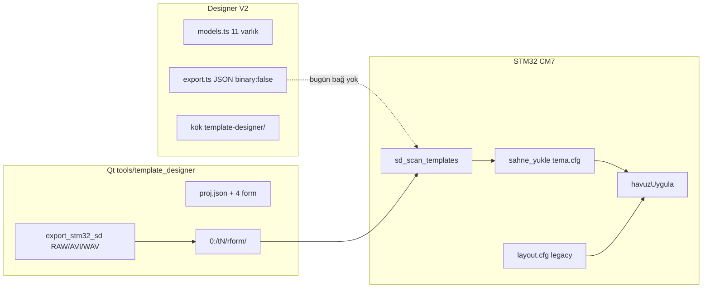
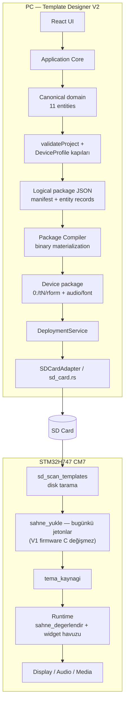
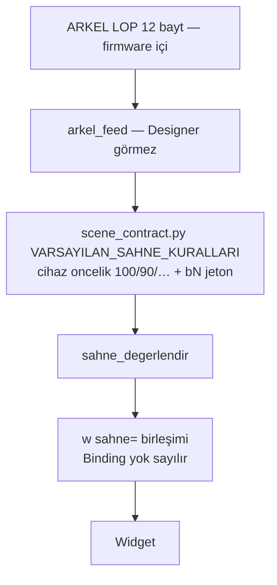
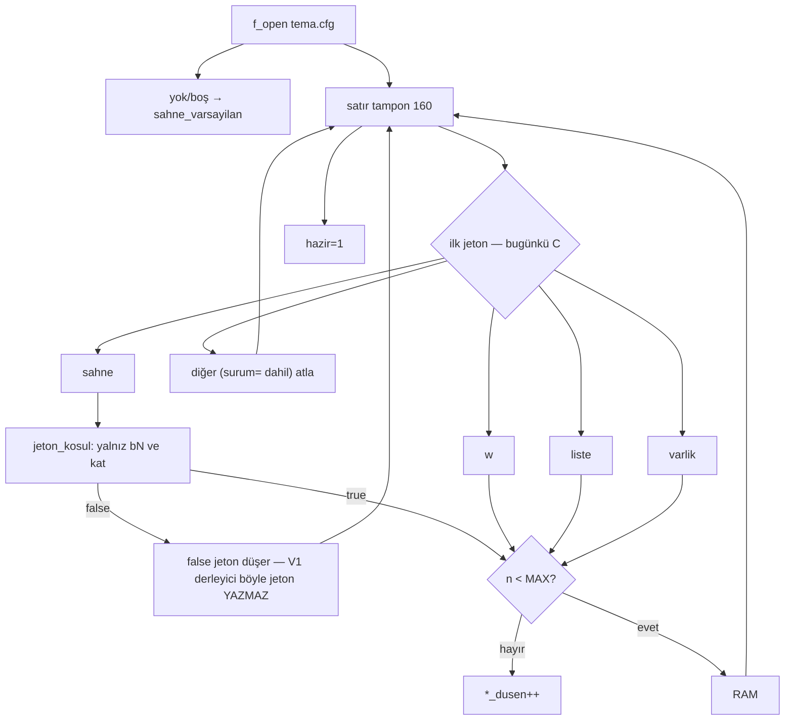

# Template Designer V2 ↔ STM32 Firmware — Paket sözleşmesi tasarım ve errata planı (2026-08-19)

> **Bu dosya kanon değildir.** Paket/tema kanonu hâlâ `docs/template-designer/contracts/` altındaki **dört** sözleşmedir. Bu metin o dörtlüyü düzeltmek için gerekçe, 11 parser varlığı, derleyici kuralları ve PR sırasıdır. Beşinci paralel sözleşme yoktur.

| Alan | Değer |
|------|--------|
| Belge | Cross-repo package contract — Template Designer V2 + STM32H747 firmware |
| Yazar | (tasarım ajanı; kod yazılmadı) |
| Tarih | 2026-08-19 |
| Revizyon | 2026-08-19 r7 — kullanıcı Qt yazıcı + theme/assets/simulator/Tk/araclar sildi |
| Durum | Review geçti; **bu depoda paket yazıcı yok** |
| Dil | Türkçe (tanımlayıcılar, yollar ve kod orijinal dilinde) |
| Depolar | `C:\Users\b1601\Template_Designer` · `C:\TouchGFXProjects\MyApplication_6` |
| Sözleşme hedefi | `C:\TouchGFXProjects\MyApplication_6\docs\template-designer\` (mevcut sözleşmelere errata; beşinci paralel kanon yok) |
| Taşıma | V1 yalnız `PC → SD Card → cihaz`. Wi-Fi/ESP32 rezerve, uygulanmaz |
| Kapsam | Tasarım ve plan. Ürün/firmware kodu bu belgede üretilmez |
| V1 sıra | Mimari A4; **uygulama sırası A5**: bugünkü `tema.cfg` + değiştirilmemiş firmware dumanı önce |

---

## Overview

İki depo bugün aynı ürünü iddia eder ama **aynı paketi konuşmaz**. Template Designer V2 (`C:\Users\b1601\Template_Designer`) **kanonik ürün UI**’dır (KD-10 kilit, 2026-08-19). STM32H747 firmware (`C:\TouchGFXProjects\MyApplication_6`) kartı `0:/t<N>/r<form>/` altında tarar ve **satır tabanlı `tema.cfg` + `layout.cfg` + cihaz ikilileri** (RAW/BMP/JPEG, MJPEG AVI, WAV, glif atlası) okur. Kök demo `MyApplication_6/template_designer/` ajan sildi. **Kullanıcı ayrıca sildi (2026-08-19):** `tools/template_designer/` (Qt yazıcı + `scene_contract.py`), `tools/theme/`, `tools/assets/`, `tools/simulator/`, Tk, `template_designer_araclar`. Bu firmware deposunda paket yazıcı **yok**. Tek ürün = V2. Compiler V2 içinde kurulur; silinen Python git geçmişinden geri alınabilir.

Bu belge tek, sürümlenmiş bir **cihaz paketi sözleşmesi** tanımlar. Sözleşmenin omurgası kullanıcının 11 parser varlığıdır; bunlar genel bir `theme.json` ile ikame edilmez. Designer V2 bu varlıkları yazar; **V1 derleyici bugünün `sahne_yukle` gramerini** (`bN&maske`, `bN=`, `kat<op>`) üretir. Firmware C’si V1 dumanına kadar değişmez. `state=`-yalnız satır **yasaktır** (eski parser koşulu düşürür, kural `kosul_n==0` ile varsayılan sahne olur — alarm fail-open). Mevcut `tema.cfg` / `layout.cfg` / ikili boru hatları silinmez.

```text
Template Designer V2
        │
        │ template/package contract
        ▼
   SD Card Package
        │
        ▼
 STM32 Firmware Parser
        │
        ├── Project
        ├── Theme
        ├── Rotation
        ├── Scene
        ├── Widget
        ├── Asset
        ├── Binding
        ├── Glyph Atlas
        ├── Image
        ├── Video
        └── Runtime State
        │
        ▼
   STM32 Runtime
        │
        ▼
 Display / Audio / Media
```

---

## Background & Motivation

### Neden şimdi

Firmware `AGENTS.md` kural 7: *«Tema paket formatı, Designer ve firmware arasında ortak ve sürümlenmiş bir sözleşmedir; iki tarafta bağımsız schema icat edilmez.»* Bugün üç bağımsız şema vardır:

1. **V2 mantıksal paket** — `src/Core/export.ts` `buildDeploymentPackage()`: `manifest.json` + `themes/{id}/theme.json` + `themes/{id}/rotations/{id}.json` + `assets/{id}.asset.json` (`binary: false`).
2. **V2 belge örneği** — `docs/DEPLOYMENT_FORMAT.md` hâlâ genel `theme.pkg` ağacı çizer ve *«firmware parser semantiği icat etme»* der.
3. **Cihazda çalışan paket** — `docs/depo/tema_yapisi.md` + `sahne_yukle()` + Qt `export_stm32_sd()`: `0:/t<N>/r0|r90|r180|r270/{layout.cfg,tema.cfg,img,video}` + tema kökünde `audio/` ve `font/`.

Bu üçü birleştirilmeden V2’nin «SD’ye yazdım» iddiası cihazda boş ekran veya vanilla temaya düşer.

### Mevcut acı noktaları (doğrulanmış)

| Acı | Kanıt |
|-----|--------|
| V2 paketi cihazda görünmez | `PACKAGE_ROOT_DIRECTORY = "template-designer"` (`src/Core/removable-storage.ts:117`). Firmware `0:/t%d` tarar (`sd_config.h` `SD_TEMPLATE_ROOT_FMT`) ve `0:/config.txt` okur. |
| V2 ikili medya yazmaz | `export.ts:74-93` açıkça «binary materialization belongs to the adapter»; `assets/*.asset.json` yalnız `sourcePath` taşır. |
| V2 SD hedefi çelişkili | `SDCardTarget.deploy` `SD_CARD_DEPLOYMENT_NOT_IMPLEMENTED` fırlatır (`sd-card-target.ts:11-16`); buna karşılık `DeploymentService.deployToSdCard` + Tauri `sd_card.rs` gerçek yazım/doğrulama yolunu içerir. Adapter düzlemi ile gerçek yol ayrışmıştır. |
| Firmware JSON okumaz | `CM7/` altında `cJSON` / `jsmn` / JSON parser **yok** (arama 2026-08-19, eşleşme yok). Tek tema parser: satır tabanlı `sahne_yukle()` (`sahne_motoru.c:197`). |
| Sahne/bağlama modelleri ayrışık | V2: `Binding` widget düzeyinde, öncelik 0–15, `DeviceProfile` state id. Firmware: `sahne` kuralları ARKEL `bN&maske` / `kat<op>`, **cihaz `oncelik` 100/90/…/0** (`scene_contract.py`); UI 0–10 yazılmaz. Widget `sahne=` görünürlük listesi. |
| Çift designer | Firmware `AGENTS.md:100` hâlâ Qt’yi «AKTİF masaüstü» sayar — **bayat**. Karar: tek ürün UI = V2. Kök demo `MyApplication_6/template_designer/` **silindi 2026-08-19**. `tools/template_designer/` donmuş yazıcı; silme planı yok. |
| DeviceProfile gerçekçi değil | `foundationDeviceProfile.videoCapabilities` `h264` + `1920×1080` + `maxConcurrentDecode: 1` (`factories.ts:41-46`). Cihaz: donanım JPEG MJPEG/AVI, tavan `VIDEO_MAX_W/H = 720×1280`, sahne bütçesi `VIDEO_BUDGET_PX = 921600`, 4 çözücü (`media_config.h`, `sd_content_manager.h`). |
| Belge çelişkileri | Closure Karar 1 **eski OPEN** — r5: Designer 5 rol / cihaz 2 otobüs. `docs/DEPLOYMENT_FORMAT.md` `theme.pkg` örneği. Firmware `docs/depo/tema_yapisi.md` (2026-07-31) `font/` klasörünü henüz yazmaz; `sd_theme_font_path` sonradan eklenmiştir. |

---

## Goals & Non-Goals

### Goals

1. 11 parser varlığı için tek, sürümlenmiş paket sözleşmesi (Designer domain ↔ disk ↔ firmware parser ↔ runtime).
2. V2’nin mantıksal JSON’unu **cihaz paketine** derlemek: editable project ≠ deployment package.
3. Mevcut `tema.cfg` / `layout.cfg` / ikili varlık boru hatlarını dual-read ile korumak.
4. Binding ile Scene’i ayrıştırmak; ARKEL bitlerini Designer UI/modeline geri sokmamak.
5. Savunmacı STM32 parser: bozuk/eksik/desteklenmeyen paket sistemi çökertmez.
6. Designer, firmware’in desteklemediği özelliği yayınlamaz.
7. Çift-designer’ı kapatmak: kanonik UI = V2; kök demo silindi (2026-08-19); Qt `tools/template_designer/` donmuş yazıcı (silme planı yok).
8. Kanıta dayalı temizlik envanteri (silme bu görevde yapılmaz).
9. İki depo için küçük, tersine çevrilebilir PR sırası.

### Non-Goals

- Bu belgede ürün veya firmware kodu yazmak.
- MCU üzerinde tam JSON parser’ı V1’de zorunlu kılmak (ölçülmeden).
- Wi-Fi / ESP32-C6 / bulut / cihaz web UI.
- Firmware’de PNG/MP4 dönüştürme.
- Çalışan `sahne_yukle` / `sd_load_template_layout` / `gorsel_yukle` / `glif_atlasi` / `export_stm32_sd` silmek.
- 11 varlığı tek `theme.json` içinde eritmek.
- V1’de beş kanallı MCU mikseri icat etmek (cihaz FON+ANONS kalır).
- Ölçülmemiş RAM/SDRAM/SD bütçesi uydurmak.
- `tools/template_designer/`, `tools/legacy/template_designer_tk/` veya `template_designer_araclar` silmek (ankette yok; silme planı yok).

---

## Current-state map

### A. Template Designer V2 — `C:\Users\b1601\Template_Designer`

Katmanlar `AGENTS.md` ile uyumludur: `UI → Application Service → Domain/Core → Adapter`. Tauri kabuğu native I/O’yu `src-tauri/src/sd_card.rs` içinde tutar.

| Katman | Yol | Durum |
|--------|-----|--------|
| Ürün spec | `Template Designer — Ana Proje Geliştirme Promptu.md`, `AGENTS.md` | Yetkili V1 sınırı (PC→SD, offline, Tauri tercih) |
| Domain | `src/Domain/models.ts` | **Gerçek.** Project, DeviceProfile, ThemeProject, Rotation (tam 4 açı), Scene, Widget, Binding (0–15), Asset, MediaSlide, RuntimeStateDefinition, DeploymentPackage |
| Fabrika / profil | `src/Domain/factories.ts` | `foundationDeviceProfile` 720×1280 ve 4 açı doğru; video/ses yetenekleri firmware ile **uyumsuz** |
| Runtime değerlendirici | `src/Core/runtime.ts` | Scene seçimi (öncelik 0–10 + activationOrder) ve Binding değerlendirmesi **PC’de** çalışır; cihaza yazılmaz |
| Doğrulama | `src/Core/validation.ts` | Proje/asset/binding kapısı; cihaz bütçesi (`VIDEO_BUDGET_PX`, arena, widget 16) **yok** |
| Mantıksal paket | `src/Core/export.ts` `buildDeploymentPackage()` | JSON-only; `verified: false` ile doğar; `verifyDeploymentPackage` SHA-256 |
| SD servisi | `src/Core/deployment-service.ts` `deployToSdCard` | Preflight → write → read-back. Kök: `template-designer/` |
| SD stub | `src/Infrastructure/sd-card-target.ts` | Hâlâ `SD_CARD_DEPLOYMENT_NOT_IMPLEMENTED` — servis yolunun **dışında** ölü adapter |
| Native I/O | `src-tauri/src/sd_card.rs` | Windows removable, path safety, `sync_all`, `sd_copy_file`. Eject bugün `EJECT_UNSUPPORTED` — **V1 niyeti native güvenli çıkar** (OQ-7 kilit; PR-19). |
| İkili derleme | — | **Yok.** PNG→RAW, MP4→MJPEG AVI, font→atlas, 90/270 ön-döndürme V2’de yok |
| Karar kapanışı | `docs/PRODUCT_DECISION_CLOSURE_V1.md` | Media Slide domain = sıralı dizi; **V1 yayın = tek öğe** (OQ-5). Binding 0–15. Kat Unicode gösterim. Ses: r5 5 rol / 2 otobüs. |

V2 paket ağacı (bugün, mantıksal):

```text
template-designer/          ← firmware bunu okumaz
  manifest.json
  themes/{id}/theme.json
  themes/{id}/rotations/{id}.json
  assets/{id}.asset.json    ← binary: false
```

### B. STM32 firmware — `C:\TouchGFXProjects\MyApplication_6`

| Öğe | Doğrulanmış değer | Kaynak |
|-----|-------------------|--------|
| MCU | STM32H747XIH, CM7+CM4 | `AGENTS.md`, `docs/architecture/01_architecture_overview.md` |
| Panel | 7" DSI 720×1280 dikey | aynı |
| Grafik | LTDC + DMA2D | aynı |
| Video | Donanım JPEG, MJPEG/AVI | `media_config.h`, `sd_query_avi_size` yalnız MJPG |
| Ses | I2S1 + DMA, 44 100 Hz, FON+ANONS mikser | `docs/audio/04_audio_subsystem.md` |
| Depolama | SDMMC/FatFS | `sd_content_manager.c` |
| Saha | USART1 ARKEL LOP, 9600 9-bit | `AGENTS.md` |
| Tek çizim yolu | `tema_kaynagi` → `havuzUygula()` → TouchGFX | `tema_kaynak.h` |
| Sahne parser | `sahne_yukle()` satır tabanlı `tema.cfg` | `sahne_motoru.c` |
| Yerleşim parser | `sd_load_template_layout()` `layout.cfg` | `sd_config.c:292` |
| Tema keşfi | Disk tarama; manifest tek başına güvenilmez | `sd_scan_templates()`; Qt `paket.py` |
| Widget türleri | `W_IMAGE W_MEDIA W_DIGIT W_ARROW W_LIST W_TEXT W_CLOCK` | `sahne_motoru.h:68-77` |
| Sahne koşulları | `KOS_BIT KOS_ESIT KOS_KAT_*` | `sahne_motoru.h:41-48` |
| JSON parser | **Yok** | CM7 araması |

Ölçülmüş / kodda sabitlenmiş tavanlar (uydurulmadı):

| Bütçe | Değer | Kaynak | Not |
|-------|-------|--------|-----|
| Tema arenası | **2 MB**, `.sd_media`, 32 B hizalı bump | `TEMA_ARENA_BAYT` `sd_content_manager.h:89`; `docs/planning/PLAN.md:257-263`; `glif_atlasi.md:46-54` | Tema değişince işaretçi sıfırlanır; başarısız yükleme yer harcamaz |
| Video tavan (tek dosya) | 720×1280 | `VIDEO_MAX_W/H` `media_config.h` | Tampon tavanı, geometri değil |
| Video sahne bütçesi | **≤ 921 600 px** (`1280×720`) | `VIDEO_BUDGET_PX` (`media_config.h`); Qt `model.py` `VIDEO_BUTCE_PX = 1280 * 720` (`designer_api.py` kullanır). `export_cfg.py` aktif `tools/template_designer/` içinde **yok** (2026-07-31 kaldırıldı; `media_config.h` yorumu bayat) | Tam ekran bir video bütçenin tamamını yer |
| Tam ekran kare süresi | ~34 ms (SWD/DWT, günlük 19) | `media_config.h:43-45` | Ölçülmüş |
| Widget havuzu | **16** | `WIDGET_MAX` | Aşınca `widget_dusen++`, sessiz kırpma yok |
| Sahne kuralı | **16** | `SAHNE_MAX` | `kural_dusen` |
| Koşul / kural | 4 AND | `SAHNE_KOSUL_MAX` | Aynı ada birden çok satır = OR |
| Medya listesi | 4 | `LISTE_MAX` | Bugün liste başına tek dosya saklanır |
| Varlık bağlama | 24 | `VARLIK_MAX` | |
| Glif atlas önbelleği | **2** atlas; 3. font widget düşer | `glif_atlasi.md:48-49` | Tipik 1 atlas ~90 KB + 8 kutu ~192 KB ≈ 280 KB (ölçülmüş açıklama) |
| Metin kutusu tavanı | 720×300 | `glif_atlasi.md:54` | Aşınca ayırıcı NULL, zarif bozulma |
| Video çözücü | 4× HardwareMJPEGDecoder | `sd_content_manager.h:25-34` | 1× 512 KB + 3× 256 KB AVI tampon |
| Bitmap bütçesi | 16→17 (t0/r0, 2026-08-06 cihaz) | `PLAN.md:248-252` | Ölçülmüş |
| Fon halkası | 1 MB SDRAM | `04_audio_subsystem.md` | RAM’e tam WAV yükleme yok |
| SDRAM toplam | 16 MB | `06_memory_and_linker.md` | framebuffer 2×1,84 MB + video RGB 2×1,84 MB |
| Tema kimliği tavanı | 0..15, VANILLA=15 | `TEMPLATE_COUNT 16` | `export_sd.py` `FW_TEMA_TAVANI = 16` |
| Safe eject (V2 bugün) | `EJECT_UNSUPPORTED` | `sd_card.rs` | **V1 niyeti:** uygulama kartı kendisi çıkarsın (OQ-7 kilit). OS metni yetmez. |

Cihaz paket ağacı (bugün yetkili; `tema_yapisi.md` + sonradan `font/`):

```text
0:/config.txt                 # TEMPLATE, ORIENTATION, stiller, ses — paket kimliği değil
0:/t<N>/                      # N tarama ile bulunur; bitişik olmak zorunda değil
    audio/                    # 4 formda ortak
    font/<ad>.raw + <ad>.cfg  # forma bağımsız glif atlası (sd_theme_font_path)
    r0|r90|r180|r270/
        layout.cfg            # template_layout_t (hâlâ okunur)
        tema.cfg              # sahne/widget/liste/varlik — sahne_yukle
        img/                  # RAW (ARGB8888 başlıklı) / BMP / JPEG
        video/                # MJPEG AVI; ad serbest, tarama + manifest yolu
        proj.json             # designer kaynağı; firmware ihtiyaç duymamalı
    [kökte proj.json / package.json — Qt paket.py; firmware okumaz]
0:/muzik/                     # tüm temalarda ortak fon (opsiyonel)
```

**Disk tarama doktrini (iki tarafta aynı):** `sd_scan_templates()` `layout.cfg` veya `img/` varlığına bakar; `config.txt` içindeki `TEMPLATE_COUNT` yok sayılır. Qt `paket.py`: *«MANIFEST TEK BASINA GÜVENİLMEZ»*.

### C. Qt/Python designer (çalışan yazıcı)

| Yol | Rol |
|-----|-----|
| `tools/template_designer/` | Bugünün **çalışan / donmuş cihaz yazıcısı** (giriş: `python qtui/app.py`). Ürün UI değil. **Silme planı yok** (ankette seçilmedi). PR-18 dumanına kadar kalır. |
| `publish_service.py` `build_and_publish` | Tek resmi yayın hattı |
| `export_sd.py` `export_stm32_sd` | PNG/JPEG→`.raw` BGRA, BMP, AVI döndürme, `layout.cfg` |
| `designer_api.py` `_write_manifest` | `tema.cfg` üretir; `layout.cfg` ile aynı `lay` sözlüğünden |
| `glif_atlasi.py`, `gorsel.py`, `rotate_avi.py` | Cihaz biçimleri; firmware dönüştürmez |
| `scene_contract.py` + `scene_ids.py` | Kanonik sahne adları ve varsayılan ARKEL kuralları |
| `tools/legacy/template_designer_tk/` | Tk; aktif değil |
| `tools/legacy/template_designer_araclar/` | `tema_akis.py` hâlâ `tema_ops.py` çağırır — **köprü, kör silinmez** |
| `MyApplication_6/template_designer/` | Demo Qt tuval iskeleti. **Silindi 2026-08-19** (orkestratör; yalnız bu klasör). |

### D. Çelişki özeti



---

## Canonical pipeline

Hedef boru, kullanıcının diyagramı ile birebir. Taşıma V1’de yalnız SD’dir; paket taşıma-bağımsız kalır.



Sıra (V1 kabul testi ile aynı, `AGENTS.md`):

```text
Open/Create Project
 → Edit Template (11 varlık)
 → Preview (PC runtime.ts; cihaz semantiğini taklit eder)
 → Validate (profil + cihaz tavanları)
 → Build Deployment Package (mantıksal JSON)
 → Compile Device Package (ikili + tema.cfg/layout.cfg)
 → Select SD Card
 → Write 0:/  (kök template-designer/ DEĞİL)
 → Verify read-back
 → Native Windows safe-eject (PR-19; `EJECT_UNSUPPORTED` kalkar)
 → Kart cihaza
 → Parser → Runtime → Display/Audio/Media
```

---

## Proposed Design

### 1. Tek sözleşme, iki serileştirme (mimari A4)

Bağımsız ikinci şema **yok**. 11 varlık kanonik modeldir. İki yazım biçimi aynı modeli taşır:

| Serileştirme | Tüketici | Biçim |
|--------------|----------|--------|
| Mantıksal | V2 editor, test, SHA-256, gelecekte Wi-Fi aynı paket | Sürümlenmiş JSON kayıtları |
| Cihaz | STM32 `sahne_yukle` + FatFS | Bugünkü klasör + **bugünün** satır tabanlı `tema.cfg` / `layout.cfg` + ikililer |

V2 `export.ts` çıktısı **ara üründür**. Karta yalnız `DevicePackage` gider. Mantıksal JSON `template-designer/` altına **debug** olarak yazılabilir (A8); cihaz yazımı sürücü köküdür.

### 2. V1 compiler yolu (tek seçim — A6/TS-native)

V1 **Qt `publish_service.build_and_publish` subprocess köprüsü yoktur.** `publish_service.py` `if __name__` CLI sunmaz; girdi Qt `Project` / `proj.json` (`wid`, `forms`, `mirror_of`, `video_src`) olup V2 domain değildir. Çapraz depo PySide6 yolu Tauri UI’ya konmaz.

**Seçilen yol:** TypeScript-native **metin üretici** (`tema.cfg`, `layout.cfg`, `config.txt`, `floors.csv`, `package.json`) + Tauri/Core **adapter** üzerinden belgelenmiş ikili araçlar. Adapter UI değildir.

| Çıktı | Üretici | Girdi sözleşmesi |
|-------|---------|------------------|
| `tN/r<form>/tema.cfg` | TS `emitTemaCfg(deviceModel)` | Aşağıdaki V1 gramer; yalnız `sahne_yukle`’nin bugün parse ettiği jetonlar |
| `tN/r<form>/layout.cfg` | TS `emitLayoutCfg` | Hikâye B: V2 `ad` → `template_layout_t` anahtarları (§5 tablo). Satır ≤64. `adim_x`/`adim_y` bu dosyada da yazılır (bugünkü C yok sayar; `w kat_no` okur) |
| `tN/data/floors.csv` | TS | Satır kuralı §3.11: `firmwareValue` → `int8` veya Validate; `displayValue` → `left` **ve** `right` (31) |
| `0:/package.json` | TS | Kökte **yalnız bu ad**. Qt `format: savas-template-package`, `version: 2`, `templates[]`. `0:/manifest.json` **yazılmaz** |
| `0:/config.txt` | TS, **politika aşağıda** | Mevcut saha anahtarlarını ezme |
| `img/*.raw` | Adapter: PIL eşdeğeri veya `export_sd.raw_save` semantiğini uygulayan küçük araç | u16le w,h + BGRA; kutu `exact` (compiler ölçekler) |
| `img/*.bmp` | aynı, uyarı/logo | `sd_load_widget_image` RAW açmaz |
| `img/bg/*.jpeg` | Encoder kalitesi **düğme**: Qt bg **q=88** (`designer_api.py:1242`) ile başla, dosya ≤ `JPEG_FILE_BUF_SIZE` **64 KB** olana kadar düşür (`sd_content_manager.h:15`). q=78 AVI kare JPEGidir (`make_theme_assets.py:243`), arka plan değil. `export_sd.py:330` bg q=90. | Aşım Validate hatası |
| `video/*.avi` | Adapter: `write_mjpeg_avi` etrafında **ince CLI** (fonksiyon, `if __name__` yok). Ölçü = **xform sonrası widget FB `w×h`**, çift, ≤ `VIDEO_MAX_*`, sahne Σ ≤ 921600. `rotate_avi.py` argv3/4 = o izleyici ölçü; **620×720 varsayılanı dondurulmaz** | Ses şeridi yok; H264 yok; RIFF TS/Rust’ta yeniden yazılmaz |
| `font/<ad>.raw+.cfg` | `glif_atlasi.py --ttf <yol> --punto 32` | TTF yolu adapter config `fontSources[fontAd]` (mutlak). `DeviceProfile.fonts` yalnız ad. TTF yok + text = `TEXT_FONT_TTF_MISSING` |
| `audio/*.wav` | Adapter: PCM 16-bit, 44100 veya tam kat 22050 (`audio_player.c` `MIX_RATE`) | Yalnız **FON** veya **ANONS** otobüsüne eşlenen roller. Eşlenmeyen Media/Video/External → `AUDIO_CHANNEL_NOT_ON_DEVICE` |

Qt `tools/template_designer/` **donmuş üretim yazıcısı**dır; V2 compiler onun **disk semantiğini** yeniden üretir (`Project` nesnesini çağırmaz). Klasör **silinmez** (ankette yok; silme planı yok).

### 3. Geometri uzayı (rotation başına)

| `Rotation.angle` | V2 canvas (`width×height`) | Disk `tema.cfg` / `layout.cfg` | Raster |
|------------------|----------------------------|--------------------------------|--------|
| 0 | 720×1280 form tasarım uzayı | Aynı; `export_sd.xform` rot=0 | Döndürme yok; kutuya LANCZOS |
| 90 | 1280×720 **izleyici** uzayı | `xform` rot=90 → 720×1280 FB: `(dsh-y-h, x, h, w)` | Piksel `ROTATE_270` (Qt `rot_img`) sonra `exact` FB kutu |
| 180 | 720×1280 form tasarım uzayı | `xform` rot=180: `(dsw-x-w, dsh-y-h, w, h)` | `ROTATE_180` + `exact` |
| 270 | 1280×720 izleyici | `xform` rot=270: `(y, dsw-x-w, h, w)` | `ROTATE_90` + `exact` |

`dsw,dsh` = o formun **tasarım** ekranı (`orient_screen_size`). Framebuffer her zaman 720×1280. **Compiler ölçekler ve döndürür; firmware ölçeklemez / döndürmez.** V2 90/270 geometrisi zaten landscape ise `xform` **bir kez** uygulanır — ikinci kez uygulanmaz.

### 4. Paket kökü ve keşif

| Kural | Karar |
|-------|--------|
| Cihaz kökü | `0:/` — yalnız `DevicePackage` |
| Mantıksal debug | `PACKAGE_ROOT_DIRECTORY = "template-designer"` **kalır** (A8); `buildDeploymentPackage()` JSON’u karta kökten yazılmaz |
| Tema keşfi | `sd_scan_templates`: geçerli formda `layout.cfg` **veya** `img/` dizini. `TEMPLATE_COUNT` 16 tavanı (`id==15` VANILLA atlanır). `tema_yapisi.md` «sayı sınırı yoktur» **errata**: tarama 0..14 |
| `package.json` | Qt `format: savas-template-package` `version: 2` ile bir arada yaşar. V2 aynı anahtarları yazar veya dokunmaz. Keşif için yeterli değil |
| `proj.json` | Firmware açmaz |
| `config.txt` | Saha ayarı. Politika: yoksa `TEMPLATE=<slot>` + `ORIENTATION=0` yaz; varsa `TEMPLATE=`’i bu yayın slotuna güncelle; **VOLUME / LANG / SOUND / CLOCK_SECONDS / DATE_FORMAT ezme**. Qt bugün tüm dosyayı yeniden yazar ve çok form sonrası `ORIENTATION=0` zorlar (`publish_service.py:251-260`) — V2 bu ezmeyi **yapmaz** |

**UUID → `t<N>` (OQ-6 kilit, 2026-08-19):** yayın anında UI **kullanıcıya sorar** hangi `t0`…`t14`. Otomatik «ilk boş slot» **yok**. Sessiz `t0` üzerine yazma **yok**. Slot doluysa onaylı üzerine yazma. `id==15` VANILLA asla. Seçilmezse Validate `THEME_SLOT_REQUIRED`. `config.txt` `TEMPLATE=` seçilen slota güncellenir. `package.json` `templates[].id` aynası o slotu yazar.

### 5. Dual-read / göç — V1 emisyon kilidi

**Bugünkü C (`sahne_yukle`, `sahne_motoru.c:197`) `surum` okumaz.** `surum=2` satırı `sahne `/`w `/`varlik `/`liste ` değilse atlanır; dosya yüklenir. Bu V1’de **korunur**. Büyük sürüm → vanilla **kill-switch yoktur**.

```text
V1 sahne_yukle (C değişmez):
  1. 0:/tN/r<form>/tema.cfg aç
  2. Yok/boş → false → sahne_varsayilan()
  3. Satır türü sahne|w|varlik|liste|anahtar=değer|yorum
  4. sahne satırında jeton_kosul yalnız: bN&maske, bN=değer, kat=|<|>|!=
  5. jeton_kosul false → o jeton düşer
  6. Tüm koşul jetonları düşerse kosul_n==0 → kural KOSULSUZ (varsayılan)
  7. layout.cfg yok → template_layout_t varsayılanları
  8. İkili yok/bozuk → TEMA_BITMAP_YOK, gizle
```

**V1 derleyici yasağı:** `state=`, `binding=`, veya `jeton_kosul`’un reddedeceği herhangi bir koşul **yazılmaz**. Alarm satırı her zaman `sahne yangin : oncelik=100 b3&0x20` (ve ikinci satır `b7=3`) biçimindedir. `state=`-yalnız yangın kuralı bugünkü firmware’de **yangını varsayılan sahne yapar** — fail-open. Altın test (V1, C değiştirmeden): eski `sahne_yukle` bir `state=`-yalnız yangın kuralını `kosul_n==0` saymamalı **çünkü böyle satır üretilmez**; üretilirse test kırmızı.

`state=` ancak **post-acceptance** ve o zaman **çift emisyon** (`b3&0x20` **ve** `state=fire`) + sahada minimum firmware kanıtı. Asla `state=` yalnız.

`layout.cfg` okuyucusu **silinmez**. **V1 hikâye B (tek otorite = Qt `lay`):** değiştirilmemiş firmware ilk tüketicidir (`Screen1View.cpp:144` `sd_load_template_layout`; `imgLogo.setXY(m_layout.logo_x, …)`; vanilla `kat_no` birler hücresi + `adim` tens−units, `:3723-3743`). Tarama-only (hikâye A) **seçilmez** — çizimin %100 `tema.cfg` `w` olduğu kanıtlanmadı. Compiler her forma **tam** `layout.cfg` yazar.

**Tek `lay` haritası (V2 widget `ad` → `layout.cfg` + `tema.cfg` `w`).** Generic / bilinmeyen `ad` yalnız `w` satırındadır (layout anahtarı yok). Bilinen `ad` **her iki** dosyaya gider.

| V2 `ad` / tür | `layout.cfg` anahtarları (`sd_config.c:326-344`) | `tema.cfg` `w` |
|---------------|--------------------------------------------------|----------------|
| `kat_no` (`digit`) | `dig_tens_x/y`, `dig_units_x/y`, `dig_1_x/y`, `dig_y`, **`adim_x`/`adim_y`** | `w kat_no` : `x,y` = **birler** (`dig_units_*`); `w,h` = tens∪units FB birleşimi; **`adim_x`/`adim_y` aynı sayılar** |
| `ok` (`direction`→`arrow`) | `dir_x`, `dir_y` = xform köşe | `w ok` : tam FB kutu |
| `logo` (`image`) | `logo_x`, `logo_y` | `w logo` |
| ilk `media` (`videoWidget1`) | `bg_x`, `bg_y` (Qt `fb("video")` — arka plan konumu video kutusundan) | `w videoWidgetN` |
| `list` | V1 list widget **yok** → Qt gizleme: `list_x=0 list_y=<FB_H> list_w=720 list_h=1` | satır yok |
| `u_*` / `bg` / `imgN` / `textN` | anahtar yok | yalnız `w` |

`color` / `bg_color`: `themeDefaults` varsa o; yoksa Qt varsayılan (`color=0`, `bg_color=0E141B`). `warn_*` Qt yazar, C okumaz — V1 **yazılmaz**.

**V2 tek digit kutusu → hücreler (Qt `_from_project` / `designer_api.py:183-190`, sonra `xform` bir kez):**

```text
Girdi: V2 digit Widget.geometry izleyici (x, y, w, h). w<2 → Validate DIGIT_BOX_TOO_SMALL.
Hücre sabiti: DIGIT_W=240, DIGIT_H=370 (sd_content_manager.h:155-156).
  dw = min(DIGIT_W, w);  dh = min(DIGIT_H, h)
  w < 2*dw ise dw = max(1, w//2)   # taşma yok
  gap = max(0, w - 2*dw)
  tens_v  = (x,               y, dw, dh)   # onlar — izleyici solda
  units_v = (x + dw + gap,    y, dw, dh)   # birler — izleyici sağda
  ones_v  = (x + (w - dw)//2, y, dw, dh)   # tek hane orta
Her hücreye §3 xform bir kez → FB:
  dig_tens_x/y, dig_units_x/y, dig_1_x/y
  dig_y = dig_tens_y
  adim_x = dig_tens_x - dig_units_x
  adim_y = dig_tens_y - dig_units_y
```

r90/r270: izleyici yatay bölme, xform sonrası FB’de dikey yığılır (`adim_x=0`, `adim_y≠0`). `adim=0` kutu modeli **her zaman yatay** hücredir (`sahne_motoru.h:95-103`) — r180 dikey rakamı bozar. Bu yüzden `adim_*` **zorunlu**.

Yazım:

- `layout.cfg`: hücre anahtarları + `adim_x`/`adim_y` (C `strcmp` bilmediğini atlar; vanilla hâlâ tens−units’ten türetir — aynı sayılar).
- `tema.cfg` `w kat_no`: `x=dig_units_x y=dig_units_y adim_x=… adim_y=…` (SD yolu `w->adim_*`, `Screen1View.cpp:3327-3336`).

İki dosya aynı `lay` sözlüğünden çıkar; ayrışırsa Validate `LAYOUT_TEMA_DIGIT_MISMATCH`.

---

## Package contract — 11 parser varlığı

Her varlıkta **donmuş satır:** Designer tipi (veya V1 dışı) · disk yol+gramer · parser · runtime · **V1 yayın Y/N**.

### 3.1 Project

| Boyut | İçerik |
|-------|--------|
| Designer | `Project` (`models.ts:274-286`): `id`, `schemaVersion: number`, `name`, `deviceProfileId`, `deviceProfileVersion?`, `themeProjectGroups`, `assets`, `defaultAssetIds?`, `projectSettings?`, `metadata` |
| Disk | Kart kökünde **yalnız** `0:/package.json` (Qt `format: savas-template-package`, `version: 2`, `templates[]`). `0:/manifest.json` **yazılmaz**. Alanlar (Qt ayna + V2): `format`, `version`, `templates[]`; V2 ekleyebilir: `schemaVersion` (integer), `packageId`, `packageVersion`, `projectId`, `projectName`, `deviceProfileId`, `deviceProfileVersion`, `themeProjectIds`, asset id listeleri, `integrity.sha256`. **Editable `Project` dizini karta kopyalanmaz.** Mantıksal `manifest.json` yalnız A8 debug kökü `template-designer/`. |
| Firmware parser | **Bugün yok.** `sd_config_read` yalnız `0:/config.txt` anahtarlarını okur. Keşif `sd_scan_templates`. |
| Runtime | Proje nesnesi cihazda yaşamaz. Seçili tema `config.txt` `TEMPLATE=` + tarama. |
| Uyum | Qt kök adı `package.json`. V2 aynı dosyayı yazar veya dokunmaz. `schemaVersion` **integer**. Firmware yok saysa tarama çalışır. |
| **V1 yayın** | **Y.** Editable dizin kopyalanmaz. Mantıksal JSON içindeki `sourcePath` cihaz paketine **yazılmaz** (gizlilik). |

### 3.2 Theme

| Boyut | İçerik |
|-------|--------|
| Designer | `ThemeProject` (`models.ts:243-251`): `id`, `name`, `rotations[4]`, `resources`, `defaultAssetIds?`, `floorMappings?`, `themeDefaults?`. Grup: `ThemeProjectGroup`. |
| Disk | `0:/t<N>/` — `N` 0..14 (`TEMPLATE_VANILLA=15` yazılım). Ad `proj.json` `building_name` (Qt otorite) veya yeni `t<N>/theme.json` `name` (firmware yok sayabilir). Ortak: `audio/`, `font/`. `floorMappings` → `0:/tN/data/floors.csv` (§3.11 satır kuralı). |
| Firmware parser | `sd_scan_templates` (`sd_config.c:169-192`): geçerli formda `layout.cfg` veya `img/` dizini. `sd_theme_path` / `sd_theme_audio_path` / `sd_theme_font_path`. |
| Runtime | `Screen1View.cpp` `applyTemplate` → `sahne_yukle` veya vanilla → `havuzUygula`. Menü tarama listesi + VANILLA. |
| Uyum | Klasör `t<N>`; tarama **0..14** (`TEMPLATE_COUNT` 16, VANILLA 15). `tema_yapisi.md` «sayı sınırı yoktur» errata. |
| **V1 yayın** | **Y.** Slot = yayın anında kullanıcı seçimi (§4). |

### 3.3 Rotation

| Boyut | İçerik |
|-------|--------|
| Designer | `Rotation` (`models.ts:210-216`): `id`, `angle: 0\|90\|180\|270` **tam dört**, `width`/`height` (90/270 takas), `scenes`. `createThemeProject` dört açıyı üretir (`factories.ts:95-116`). |
| Disk | `0:/t<N>/r0/` `r90/` `r180/` `r270/`. Donanım döndürmez (`tema_yapisi.md:42-49`); yan form varlıkları **üretimde ön-döndürülür**. Seçim `config.txt` `ORIENTATION=` + `sd_form_set`. |
| Firmware parser | `sd_form_deg()` yol kurucusuna girer. Ayrı rotation JSON’u **yok**. |
| Runtime | Framebuffer her zaman 720×1280; izleyici 90° görür. |
| Uyum | V2 `rotations/{id}.json` cihaz dosyası değil. Geometri uzayı §3. |
| **V1 yayın** | **Y.** Dört klasör zorunlu. |

### 3.4 Scene

| Boyut | İçerik |
|-------|--------|
| Designer | `Scene` (`models.ts:200-208`): `id`, `name`, `widgets`, **authoring** `priority` 0–10 (`validation.ts:289-290`), `enabled?`, `activationConditions`, `activationConditionMode`. PC: `selectActiveScene`. |
| Disk | `tema.cfg` `sahne <ad> : oncelik=<cihaz> <ARKEL jetonları>`. `ad` ≤15 (`SAHNE_AD_MAX=16` NUL dahil). |
| Firmware parser | **Var:** `sahne_yukle` + `jeton_kosul` (`sahne_motoru.c:165-195`). Debounce `SAHNE_ONAY_N=3`. |
| Runtime | `arkel_feed` → `sahne_degerlendir` → `sahne_elev_state`. |
| Uyum | **İki öncelik ayrıdır.** UI 0–10 **cihaza yazılmaz**. Cihaz `oncelik=` firmware tablosundan (aşağıda). `Scene.name` → `CANONICAL_SCENES` veya **Validate reddi**. V1 `activationConditions` **yok sayılır** (PC önizleme hariç); derleyici tablo satırlarını basar. Aynı ada birden çok `sahne` satırı = OR (firmware). |

**H747 cihaz kural tablosu** — tek kaynak `tools/template_designer/scene_contract.py` `VARSAYILAN_SAHNE_KURALLARI`. V2 kopya JSON üretir; `factories.ts` içinde ikinci tablo **yok**.

| ad | oncelik (cihaz) | kosullar (disk jetonu) |
|----|----------------:|------------------------|
| yangin | 100 | `b3&0x20` |
| yangin | 100 | `b7=3` |
| asiri_yuk | 90 | `b4&0x20` |
| servis_disi | 80 | `b5&0x08` |
| kapi_ac | 70 | `b8&0x18` |
| kapi_kapa | 60 | `b8&0x60` |
| seyir_yukari | 50 | `b5&0x10` |
| seyir_asagi | 40 | `b5&0x20` |
| bosta | 0 | *(boş — kosulsuz varsayılan)* |

**estop:** `CANONICAL_SCENES` ve `ALARM_SCENES` içinde; `LOP_BITLERI` / `VARSAYILAN_SAHNE_KURALLARI` içinde **yok**. V1: `sahne estop` **yazılmaz**. Koşulsuz `sahne estop :` varsayılan sahne olur. Simülatör-only.

Özel sahne adı veya alarmları ezecek authoring priority **red**. `SAHNE_MAX=16`; tablo 9 kural (yangın×2).

| **V1 yayın** | **Y** yalnız kanonik ad + tablo jetonları. |

### 3.5 Widget

| Boyut | İçerik |
|-------|--------|
| Designer | `Widget` Scene içinde yuvalı. `widgetType`: `media\|digit\|direction\|warning\|text`. `W_LIST` / `W_CLOCK` V2 union’da **yok** → V1 UI’dan **yayınlanamaz** (Validate). `content`/`style` opak; `icerik/font/renk/zemin/hiza/bicim/karakter/aralik` V1’de yazılmaz. **`adim_x`/`adim_y` yalnız `w kat_no` (+ `layout.cfg`)** — §5. |
| Disk | `w <ad> : tur=<disk> x= y= w= h= katman= sahne=<virgüllü kanonik adlar> kaynak=...` Satır tamponu **160** (`sahne_motoru.c:220`). `ad[15]`, `kaynak[47]`, `sahne=` **96** (`WIDGET_SAHNE_LEN`). |
| Firmware parser | `sahne_yukle` `w ` (`:230+`). `tur_coz`: yalnız `image\|media\|digit\|arrow\|list\|text\|saat`. `tur=direction` / `tur=warning` → `W_BILINMEZ`, çizilmez. |
| Runtime | `havuzUygula`. `W_MEDIA` yuva: `Screen1View::medyaAdIndisi` — `videoWidgetN` / `vidN` / `videoN`, tek hane, `N<=MEDYA_MAX` (**4**, `Screen1View.hpp:346`). Eşleşmezse «sonraki boş yuva». |

**Derleyici adlandırma (UUID `ad=` yasak).** `ad[SAHNE_AD_MAX]` (`sahne_motoru.h:34` = 16, NUL dahil) → **kullanılabilir `strlen < 16`**. `sahne_yukle` en fazla `SAHNE_AD_MAX-1` kopyalar (`:249-251`). Altın test (PR-06): üretilen her V1 `ad` için `strlen(ad) < 16`; aksi `WIDGET_AD_TOO_LONG`.

| V2 `widgetType` | Disk `tur=` | Compiler `ad` (`strlen < 16`) | Not |
|-----------------|-------------|-------------------------------|-----|
| `media` | `media` | `videoWidget1`..`videoWidget4` (12) belge sırası | 5. media Validate |
| `digit` | `digit` | `kat_no` (6); çakışan geometri Validate | `adim_*` §5 |
| `direction` | `arrow` | `ok` (2) | |
| `warning` | `image` | **Donmuş:** `u_yangin` (8), `u_asiri_yuk` (11), `u_estop` (7), `u_servis_disi` (13) | `sahne=` yalnız o alarm. Qt `uyari_sym_<canon>` **disk adı değil** (`uyari_sym_yangin`=16 MCU’da `uyari_sym_yangi`) |
| `text` | `text` | `text1`.. | Atlas yoksa Validate; V1 opsiyonel |
| *(yok)* | `list` / `saat` | — | **V1 yayın yok** |
| image/logo/bg | `image` | `logo` (4), `bg` (2), `imgN` | |

`u_*` disk adları Qt `uyari_sym_*` yerine bilinçli kısaltmadır; bit-uyumluluk Qt kartlarıyla **aranmaz** (Qt zaten 15’e kesiyordu). `estop` sahne kuralı yazılmaz; `u_estop` yine `sahne=estop` ile fail-closed kalır.

**Scene.widgets düzleştirme (V1):**

1. Binding **görünürlükte yok sayılır**.
2. Aynı compiler `ad` birden çok sahnede → tek `w` satırı; `sahne=` = o `ad`’ın göründüğü `Scene.name` kanonik kümelerinin birleşimi.
3. Aynı `ad` için geometri / `kaynak` / `tur` sahneler arası farklıysa **Validate hatası** (iki widget yaz, sessiz bölme yok).
4. Widget hiç kanonik sahnede yoksa satır yazılmaz.
5. Alarm fail-closed: `sahne=` boş + alarm sahnesi → firmware gizler (`sahne_tanim_gorunur`). Digit/ok alarm sahnelerine **konmaz** (Qt varsayılanı).

`locked` pakete yazılmaz.

| **V1 yayın** | **Y:** media, digit, arrow, warning→image, image. **N:** list, saat, serbest UUID ad, `tur=direction\|warning`. |

### 3.6 Asset

| Boyut | İçerik |
|-------|--------|
| Designer | `Asset` (`models.ts:259-272`): `id`, `name`, `sourcePath`, `mediaType?` (`image\|video\|audio`), `metadata?`. Tip yoksa kaynak kalır, referans validation’ı keser. |
| Disk | **Cihaz dosyası** `assets/{id}.asset.json` değildir. Derleyici `sourcePath` kaynağını forma göre `t<N>/r<form>/img|video` veya `t<N>/audio` altına cihaz biçiminde yazar. İsteğe bağlı `varlik <firmware_adi> : <kart_yolu>` (`tema_varlik_t`, `VARLIK_MAX=24`). |
| Firmware parser | Yol: `sahne_varlik_yol` / `kaynak=` / klasör tarama. JSON asset kaydı **yok**. |
| Runtime | Image/Video/Audio yükleyicileri. |
| Uyum | Cihaz paketi `sourcePath` **içermez**. Mantıksal `export.ts:90` hâlâ Windows yolu gömer (SHA-256 sızıntısı) — V1 cihaz derleyicisi strip eder; mantıksal paket düzeltmesi ayrı. |
| **V1 yayın** | **Y** typed asset; yolsuz kayıt cihaz ağacında yok. |

### 3.7 Binding

| Boyut | İçerik |
|-------|--------|
| Designer | `Binding` 0–15, Scene.priority’den bağımsız. |
| Disk | **V1’de satır yok.** |
| Firmware parser | **Yok.** |
| Runtime | V1 yok. |
| Uyum | **V1 görünürlük Binding’den türetilmez.** `play/pause/select-style/select-content` → Validate hata. PC `runtime.ts` önizleme için kalır. |
| **V1 yayın** | **N** (kayıt olarak). Widget yine sahne üyeliğiyle yayınlanır. |

### 3.8 Glyph Atlas

| Boyut | İçerik |
|-------|--------|
| Designer | **Ayrı domain tipi yok.** 11. parser varlığı = **compiler artefaktı**. `DeviceProfile.fonts` yalnız **ad** listesi (TTF yolu taşımaz). |
| Disk | `0:/t<N>/font/<ad>.raw` + `<ad>.cfg`. RAW: u16le gen, yük + ALFA. CFG: `punto=` `sayfa=WxH` `adet=N` + `g <kod> x y w h ilerleme sol ust`. Forma bağımsız. Repertuar: `glif_atlasi.py` `VARSAYILAN_KARAKTERLER` (ASCII + Türkçe + `°`). Varsayılan `sayfa_gen=512`. **TTF kaynağı:** adapter config `fontSources[fontAd]` mutlak yol **veya** typed font `Asset` (`mediaType` font). `--punto` varsayılan **32**. TTF yok + `text` widget = `TEXT_FONT_TTF_MISSING`. |
| Firmware parser | `glif_atlas_yukle`. Önbellek **2** atlas; 3. → widget düşer (`glif_atlasi.md:47-49`). Validate: temada `font=` benzersiz adı ≤2. |
| Runtime | `W_TEXT` RGB565. |
| **V1 yayın** | **Y** yalnız `text` widget varsa ve atlas üretilmişse. Atlas yok + text var = **N**. Clock glyph seti (`W_CLOCK`) V1 **N**. |

### 3.9 Image

| Boyut | İçerik |
|-------|--------|
| Designer | `MediaType "image"`. |
| Disk | **Zorunlu uzantı matrisi:** digit/arrow/saat glifi → `.raw`; uyarı/logo → `.bmp`; arka plan → `.jpeg`. RAW: u16le w,h + **BGRA** (Qt `raw_save`; firmware ARGB8888 LE). Compiler kutuya ölçekler. |
| Firmware parser | `gorsel_yukle` (RAW); `sd_load_widget_image` (BMP/JPEG, RAW **açmaz**). |
| Runtime | Display. |
| **V1 yayın** | **Y.** Kaynak PNG/JPEG import listesinde kalır; cihaz listesi ayrı. |

### 3.10 Video

| Boyut | İçerik |
|-------|--------|
| Designer | `video`; `MediaSlideContent`. Closure «ordered sequence» **V1 cihaza inmez**. |
| Disk | `r<form>/video/<ad>.avi` MJPEG **veya** tek görsel. `w ... tur=media kaynak=…`. `liste` V1 **tek dosya**. `duration` / slayt sıra **düşer**. |
| Firmware parser | `sd_query_avi_size` yalnız MJPG. |
| Runtime | `videoTask`, ≤4 çözücü, sahne ≤921600 px. |
| **V1 yayın** | **Y** yalnız **tek görsel veya tek video**. Sıralı foto+video / çok-öğe = Validate `MEDIA_SLIDE_MULTI_ITEM` ta ki firmware birden çok dosya okuyana (PR-14, V1 dışı). |

### 3.11 Runtime State

| Boyut | İçerik |
|-------|--------|
| Designer | Registry; kullanıcı icat etmez. `floor` string (NFC). `FloorMappingEntry` (`models.ts:230-236`): `{ firmwareValue: FloorIdentifier, displayValue, digitStyleId? }`. Closure Karar 4 `Restaurant` **gösterime** izin verir — bu `firmwareValue` değil. |
| Disk | Ham LOP **yok**. `0:/tN/data/floors.csv` (`SD_FLOORS_PATH_FMT`). Parser `sd_floors_load` (`sd_config.c:362-412`): satır 128, `FLOOR_ROWS_MAX` 64, `FLOOR_TEXT_LEN` 32, ilk alan sayısal (`atoi` → `int8_t floor_num`), sonra `left,right`. Extra CSV sütunu **yok**. |
| Firmware parser | State tablosu paketten **yok**. Decoder firmware içi. `KOS_KAT_*` yalnız sayısal `strtol`. `tema.cfg` `kat=Restaurant` **yasak**. |
| Runtime | UART → 12 bayt → sahne motoru. |
| **V1 yayın** | Profil id/sürüm + `floors.csv` **Y**. Kullanıcı `kat=` jetonu **N**. |

**`FloorMappingEntry` → CSV satır kuralı (V1, algoritma):**

```text
her entry:
  1. firmwareValue = trim + NFC
  2. Tamamı taban-10 tamsayı olmalı (işaretli: "-2","0","3","+12").
     Parse başarısız veya değer ∉ [-128,127] → Validate FLOOR_FIRMWARE_VALUE_NOT_INT.
     Örnek red: "Restaurant", "3A", "", "1.5", "128" (int8 taşması; C (int8_t)128 == -128 sessiz).
  3. floor_num = o int8
  4. displayValue → left_text VE right_text (aynı metin; UTF-8).
     Bayt uzunluğu > 31 ise 31'e kes (FLOOR_TEXT_LEN-1). Boş → mevcut FLOOR_DISPLAY_VALUE_REQUIRED.
  5. digitStyleId V1 **yok sayılır** (CSV sütunu yok). Set olsa da yayın kesilmez; stil cihaza gitmez.
  6. Satır: `{floor_num},{left},{right}\n` — başka sütun yok.
Sınır: ≤64 satır. Çift firmwareValue → mevcut DUPLICATE_FLOOR_MAPPING.
İsteğe bağlı başlık `#floor_num,left,right` (parser `#` ve sayısal-olmayan ilk alanı atlar).

Örnek: firmwareValue="3", displayValue="Restaurant" → `3,Restaurant,Restaurant`
       firmwareValue="Restaurant" → FLOOR_FIRMWARE_VALUE_NOT_INT (yayın yok)
```

### Donmuş V1 yayın özeti

| Varlık | V1 Y/N | Disk | Parser |
|--------|--------|------|--------|
| Project | Y | `package.json` (Qt format) | yok (tarama) |
| Theme | Y | `t0..t14/` | `sd_scan_templates` |
| Rotation | Y | `r0\|r90\|r180\|r270/` | `sd_form_deg` |
| Scene | Y | `sahne` + tablo jetonları | `sahne_yukle` |
| Widget | Y* | `w` + adlandırma tablosu | `sahne_yukle` |
| Asset | Y | img/video/audio, path strip | yol |
| Binding | N | — | yok |
| Glyph Atlas | Y koşullu | `font/` | `glif_atlas_yukle` |
| Image | Y | raw/bmp/jpeg matris | `gorsel_yukle` / `sd_load_widget_image` |
| Video | Y tek görsel veya tek video | MJPG AVI | `sd_query_avi_size` |
| Runtime State | Y (csv+profil) | `floors.csv` | `sd_floors_load`; LOP firmware içi |

\* list/saat/UUID ad hariç.

---

## Binding vs Scene — tek sözleşme

Üç katman ayrılır. V1’de Binding **diske inmez**.



| Katman | Soru | Öncelik | V1 kim yazar | Disk |
|--------|------|---------|--------------|------|
| Cihaz sahne kuralı | Hangi sahne aktif? | **100/90/…/0** tablosu | Compiler kopyalar `scene_contract.py` | `sahne yangin : oncelik=100 b3&0x20` |
| Authoring Scene.priority | PC önizleme | 0–10 | Kullanıcı | **yazılmaz** |
| Widget `sahne=` | Bu `ad` hangi sahnelerde? | — | Flatten: Scene üyeliği birleşimi | `sahne=seyir_yukari,bosta` |
| Binding | Widget eylemi | 0–15 | Kullanıcı (PC) | **yazılmaz** |

Kurallar:

1. Designer ARKEL bit **UI’da göstermez**.
2. `firmwareSceneRules` **firmware deposunda** `scene_contract.py` tek kaynak. V2 yalnız üretilmiş JSON’a `firmwareSceneRulesRef` ile bakar. `factories.ts` içine tablo gömülmez (AGENTS.md kural 7).
3. V1 compiler `Scene.activationConditions` / `activationConditionMode` **cihaza derlemez**. Kanonik sahneler için tablo satırlarını basar. Kullanıcı `equals/contains` → `b3&` eşlemesi V1’de yok.
4. **`state=` V1’de yok.** Post-acceptance çift emisyon (A7).
5. **Görünürlük algoritması (V1, Binding yok):** `sahne=` = flattened widget’ın bulunduğu `Scene.name` kanonik kümesi. Binding `fire+show` bir `bosta` widget’ını yangına **eklemez**. Binding `hide` sahne listesinden **çıkarmaz**. İndirgenemez action → Validate.
6. Digit/arrow canlı kat/yön Binding değildir; `gorsel_*` + ARKEL kat karakterleri (`b1`/`b2`). Floor **gösterim** `floors.csv`; `KOS_KAT_*` yalnız tamsayı firmware değeri.
7. Alarm fail-closed korunur. `estop` kuralı yok (yukarı).
8. Geometri sahne-ezmesi yok; çatışma Validate.

V1 yayın: tablo `sahne` satırları + flatten `sahne=` + media `kaynak=` + `floors.csv`.
V1 yayın değil: Binding kayıtları, `state=`, çok-öğe slayt, kullanıcı biti, koşulsuz estop.

---

## Binary materialization plan

```text
Editable Project
        │  validate
        ▼
Logical DeploymentPackage  (JSON, binary:false)  — karta kökten YAZILMAZ
        │  TS-native DevicePackage compiler + ikili adapter
        ▼
Temp ağaç tN/rform/...
        │  sd_write_package (metin) + sd_copy_file (ikili, sync_all)
        ▼
0:/  DevicePackage only
```

`sd_copy_file` writable handle + `sync_all` zaten var (`sd_card.rs`); G1 «yutulan flush» **bayat** — yeniden tartışılmaz. Compiler bu dikişi kullanır.

### Ek A — malzeme satırları (V1)

| Artefakt | Bayt / limit | Araç / semantik | Fixture |
|----------|--------------|-----------------|---------|
| RAW | `<u16le w><u16le h>` + `w*h*4` BGRA | Qt `raw_save`; kutu `exact` LANCZOS | 2×2: `02 00 02 00` + 16 B BGRA |
| BMP uyarı/logo | 24-bit | `bmp_save`; `sd_load_widget_image` | Qt `warn_yangin.bmp` |
| JPEG bg | Encoder **düğme**: Qt bg **q=88** ile başla (`designer_api.py:1242`); dosya ≤ **64 KB** (`JPEG_FILE_BUF_SIZE`, `sd_content_manager.h:15`) olana kadar düşür. q=78 = AVI kare JPEG (`make_theme_assets.py:243`), arka plan değil. `export_sd.py:330` bg q=90. `media_config.h` 8 KB **farklı** makro | LibJPEG decode | Aşım Validate |
| MJPEG AVI | fourcc `MJPG`; fps=**25**; kare JPEG q=78; **ölçü = xform sonrası widget FB `w×h`** (çift); ≤ `VIDEO_MAX_*`; sahne Σ ≤ 921600; ses şeridi yok | Adapter: `write_mjpeg_avi` (`make_theme_assets.py:234`, Python fonksiyon; `if __name__` yok) etrafında **ince CLI**. r90/r270: `rotate_avi.py` argv3/4 = o **izleyici** `w×h`, sonra §3 `ROTATE_270`/`ROTATE_90`. **620×720 dondurulmaz** (Qt dekoratif yan-tema deliği; widget kutusu o değilse kullanılmaz). RIFF TS/Rust’ta yeniden yazılmaz | `sd_query_avi_size` MJPG değilse false |
| WAV | PCM 16-bit; 44100 veya tam kat 22050; FON veya ANONS halkası (`04_audio_subsystem.md`) | Dönüştürücü adapter | Designer 5 rol / cihaz 2 otobüs. Eşlenmeyen rol Validate. Yayın: FON/ANONS WAV veya ses dosyası yok |
| Glif | ALFA sayfa; `--punto` varsayılan **32**; `sayfa` varsayılan 512; repertuar `VARSAYILAN_KARAKTERLER`; `--ttf` zorunlu | `glif_atlasi.py`; TTF = adapter `fontSources[fontAd]` veya typed font asset | 3. font Validate; TTF yok = `TEXT_FONT_TTF_MISSING` |
| `layout.cfg` | satır **64**; C anahtarları: `color,bg_x,bg_y,dir_x,dir_y,dig_y,dig_tens_x,dig_units_x,dig_1_x,dig_tens_y,dig_units_y,dig_1_y,bg_color,logo_x,logo_y,list_x,list_y,list_w,list_h` (`sd_config.c:326-344`) + V1 **`adim_x`/`adim_y`** (C atlar) | TS emit; hikâye B §5. Generic `ad` bu dosyada yok — yalnız `w` | Compiler **yazar** (tarama + vanilla `m_layout`) |
| `tema.cfg` | satır **160**; `ad` 15 (`strlen < 16`); `kaynak` 47; `sahne=` 96 | TS emit | Gramer ek B; `w kat_no` `adim_*` |
| `floors.csv` | satır 128; `FLOOR_ROWS_MAX` 64; `FLOOR_TEXT_LEN` 32 | `sd_floors_load`; satır kuralı §3.11 | `firmwareValue` int8 veya Validate |
| `config.txt` | ASCII `K=V` | Yoksa TEMPLATE+ORIENTATION=0; VOLUME/LANG/SOUND **ezme** | |
| Video bütçe | sahne Σ w×h ≤ 921600 | `model.py` `VIDEO_BUTCE_PX` / `designer_api.py` | `export_cfg.py` **yok** |

Compiler: editable kopyalanmaz; form bağımsız; temp ağaç sonra kopya; ikili read-back PR-15.

---

## Parser design (spec only)

MCU’da JSON parser **V1 yoktur**. `surum` **bilgi amaçlıdır**; C V1’de okumaz. PR-08 mevcut atlama davranışının testi, yeni reject yolu değil.



### Ek B — V1 `tema.cfg` grameri (bugünkü `sahne_yukle`)

```text
# yorum
surum=1                          # bilgi; C okumaz
sahne <ad> : [oncelik=N] [bN&maske|bN=val|kat=|kat<|kat>|kat!= val]...
w <ad> : tur=image|media|digit|arrow|list|text|saat x= y= w= h= katman= sahne=a,b kaynak=...
varlik <ad> : <yol>
liste <ad> : <dosya> [tekrar=N]
```

Satır 160’ı aşan `w` satırı jeton ortasında kesilir — derleyici satırı tampona sığdırmalı.

Politikalar:

| Konu | V1 politika |
|------|-------------|
| `surum` | Bilgi. Header yeni diye vanilla **yok**. `surum > KNOWN` **ve** hiç `sahne`/`w` yoksa ancak o zaman (post-V1, istenirse) red |
| Bilinmeyen satır türü | Atla |
| Bilinmeyen `sahne` jetonu | Düşer → `kosul_n` azalır. Derleyici böyle jeton **yazmaz** |
| `tur` bilinmeyen | `W_BILINMEZ`, gizle |
| Kapasite | `*_dusen++` |
| JSON | yok |

---

## Dual-designer resolution

**KD-10 kilit (OQ-2 çözüldü, 2026-08-19 kullanıcı).** Kanonik ürün UI = Template Designer V2 (`C:\Users\b1601\Template_Designer`). «Hangi masaüstü?» tartışması kapanır.

Firmware `AGENTS.md:100` bugün Qt’yi «AKTİF masaüstü» sayar — **bayat**. PR-01 cümlesi: «Aktif ürün UI = Template_Designer V2; kök `MyApplication_6/template_designer/` silindi 2026-08-19; `tools/template_designer` donmuş yazıcı.»

| Uygulama | Konum | Statü |
|----------|-------|--------|
| Template Designer V2 | `C:\Users\b1601\Template_Designer` | **Kanonik ürün UI** (Tauri/React). Tek ürün. |
| Qt | `tools/template_designer/` `qtui/app.py` | **Donmuş çalışan yazıcı** (PR-18 dumanına kadar). **Silme planı yok** — anket bu klasörü seçmedi. Güvenlik yaması serbest. |
| Tk | `tools/legacy/template_designer_tk/` | Arşiv. **Silme planı yok.** |
| Kök `MyApplication_6/template_designer/` | demo `qt_app.py` | **Silindi 2026-08-19** (orkestratör; yalnız bu). |
| `template_designer_araclar` | `tema_akis` köprüsü | **keep**. **Silme planı yok.** |

PR-16 ikinci kez AGENTS cümlesini yazmaz; PR-18 sonrası Qt **özellik davetini** kaldırır. Klasör silme PR’ı **yok**.

## Ses rolleri — 5 Designer / 2 cihaz otobüsü

**OQ-1 çözüldü (2026-08-19 kullanıcı, «Beş kanal anketi»).** Ürün niyeti `MEDIA_ASSET_BROWSER_QUESTIONNAIRE_V1.md:381-389` beş rolüdür. MCU bugün FON+ANONS mikseridir (`04_audio_subsystem.md`). V1’de beş kanallı MCU mikseri **icad edilmez**. Closure Karar 1 «OPEN / hiçbir şey varsayma» bu sözleşme için **kalkar**; Closure dosyası PR-01 errata.

| Designer rolü | Cihaz otobüsü V1 | Yayın |
|---------------|------------------|--------|
| Background Music | **FON** | `tN/audio/` FON listesi (PCM WAV) |
| Announcement | **ANONS** | anons WAV; firmware ANONS gelince FON kısılır (duck) — Designer yeniden yazmaz |
| Media | FON veya ANONS’a **açık eşleme** | yoksa Validate `AUDIO_CHANNEL_NOT_ON_DEVICE` |
| Video | AVI **ses şeridi yok**. Video Audio → FON/ANONS eşlemesi | yoksa aynı Validate |
| External Audio | FON veya ANONS eşlemesi | yoksa aynı Validate |

Varsayılan eşleme: BGM→FON, Announcement→ANONS. Extra roller paket/Designer **üstverisi** olabilir; cihaza ancak FON/ANONS WAV olarak iner.

Cihaz varsayılanları `04_audio_subsystem.md`: master `audio_set_volume` **1** (0–10); `SOUND` / `VOLUME` `config.txt` — V2 bunları **ezmez**. Designer yüzde varsayılanları (%20 vs %25 BGM, %70 vs %80 anons) **küçük kalan soru**; 3-kanal vs 5-kanal yeniden açılmaz.

### Mevcut FW sözleşmeleri — beşinci paralel kanon yok

Hedef dizin: `C:\TouchGFXProjects\MyApplication_6\docs\template-designer\`.

| Dosya | Rol | V1 işlem |
|-------|-----|----------|
| `contracts/template_designer_dort_rotasyon_tema_sozlesmesi.md` | `tN` + 4 form ağacı | **keep + errata** (`font/`, tarama tavanı 16, `tema.cfg`) |
| `contracts/template_designer_widget_sahne_medya_sozlesmesi.md` | UI widget/stil/`on_enter` | **keep** olarak **studio/UI** sözleşmesi; cihaz parser kanonu **değil**. Errata: sınırsız `style_id` / `background` / sahne action firmware `w` satırında yok |
| `contracts/template_designer_properties_sozlesmesi.md` | UI properties | keep, UI |
| `contracts/template_designer_studio_etkilesim_sozlesmesi.md` | UI | keep, UI |
| `README.md` | Tk `src/template_designer/domain` anlatır | **rewrite** (yanıltıcı) |

Cihaz parser grameri bu belgenin Ek B + `docs/depo/tema_yapisi.md` (font errata) + `tema_widget_modeli.md` içinde durur. Yeni `contracts/` dosyası **yalnız** «errata + 11 varlık disk tablosu» olarak **mevcut dört dosyaya işaret ederek** eklenir; ayrı kanon iddia etmez.

---

## Key Decisions

1. **On bir varlık kanonik parser modelidir.** `theme.json` bunları yutmaz. İki serileştirme, aynı model (A4).
2. **Cihaz yazımı yalnız `DevicePackage` ve sürücü kökü `0:/`.** Mantıksal JSON `template-designer/` debug kökünde kalabilir (A8).
3. **MCU V1 JSON parse etmez.** `surum` bilgi. Vanilla kill-switch yok.
4. **Mevcut parser ve ikili boru silinmez.**
5. **Designer ARKEL biti yazmaz.** V1 cihaz jetonları `scene_contract.py` tablosundan basılır. `state=`-yalnız yasak.
6. **Authoring Scene.priority 0–10 ≠ cihaz kural önceliği 100/90/…** V1 compiler UI önceliğini yazmaz. Binding 0–15 V1 diske inmez; görünürlük = Scene üyeliği birleşimi.
7. **Firmware medya dönüştürmez.** Compiler ölçekler/döndürür.
8. **Keşif = disk tarama**, tavan `TEMPLATE_COUNT` 16.
9. **Editable project ≠ deployment package.**
10. **KD-10 kilit (OQ-2 çözüldü):** kanonik ürün UI = V2. Kök demo `MyApplication_6/template_designer/` **silindi 2026-08-19**. `tools/template_designer/` donmuş yazıcı; silme **planlanmaz**. FW `AGENTS.md` PR-01’de güncellenir.
11. **Yayın kapısı DeviceProfile + ölçülmüş tavanlar.** compact profil H747’ye yayınlanamaz.
12. **Ses (OQ-1 çözüldü):** Designer 5 rol (BGM / Media / Announcement / Video / External Audio); cihaz 2 otobüs (FON+ANONS). Eşlenmeyen rol Validate. Beş kanallı MCU mikseri V1 yok.
13. **Taşıma V1 = SD.** `config.txt` saha; VOLUME/LANG ezme.
14. **Başarı doğrulamadan sonra. Eject (OQ-7 kilit):** uygulama kartı **kendisi** güvenli çıkarır (native Windows / yetki yükseltme). Yalnız OS talimatı **yetmez**. Bugünkü `EJECT_UNSUPPORTED` V1’de kalkar (PR-19). Teknik tıkanırsa araştırma PR’sı zorunlu — isteğe bağlı metin değil.
15. **V1 sıra A5:** bugünkü `tema.cfg` + değiştirilmemiş firmware dumanı, firmware rewrite’tan önce.
16. **V1 compiler A6:** TS-native metin + belgelenmiş ikili araç adapter; Qt CLI yok.
17. **Tema slotu (OQ-6 kilit):** yayın UI’sı `t0`…`t14` sorar. Otomatik ilk-boş / sessiz `t0` yok.
18. **Media Slide (OQ-5 kilit):** V1 yalnız tek görsel veya tek video. Sıralı dizi / çok-öğe Validate; firmware çok dosya okuyana kadar PR-14 V1 dışı.

---

## API / Interface Changes

Kod bu görevde yazılmaz; hedef arayüzler:

**V2 — paket derleyici (yeni, Core, platform-nötr girdi + adapter çıktı):**

```ts
// Hedef şekil — mevcut buildDeploymentPackage yerini almaz, ardına eklenir
interface DevicePackageFile {
  path: string;                 // FatFS göreli: "t0/r0/tema.cfg"
  kind: "text" | "binary";
  content?: string;             // text
  sourceAbsPath?: string;       // binary: sd_copy_file
}

interface DevicePackage {
  schemaVersion: number;
  themeSlots: readonly { themeId: string; slot: number }[]; // UUID → tN
  files: readonly DevicePackageFile[];
  integrity: { algorithm: "sha256"; checksum: string };
}
```

İki yazım kökü: `PACKAGE_ROOT_DIRECTORY` (`removable-storage.ts:117`) **mantıksal debug** için kalır. `DevicePackage` yazımı `rootDirectory: ""` (sürücü kökü). `buildDeploymentPackage()` JSON’u kökte `tN/` gibi göstermez.

`SDCardTarget.deploy` `deployToSdCard` ile birleşir veya kalkar. `tests/product-completion.test.ts:646` hâlâ `SD_CARD_DEPLOYMENT_NOT_IMPLEMENTED` bekler — PR-04 ile **taşınır**.

**Firmware V1:** `sahne_yukle` imzası ve gövdesi **değişmez**. Binding alanı yok. `tema_kaynagi` değişmez.

**DeviceProfile TypeScript delta (`1.0` → `1.1`):** mevcut `supportedFormats` **kaynak** import listesi olarak kalır (`png,jpg,jpeg,mp4,mp3,wav`). Yeni opsiyonel alanlar:

```ts
// models.ts — ek; kod bu görevde yazılmaz
interface VideoCapabilities {
  maxConcurrentDecode?: number;
  maxWidth?: number;
  maxHeight?: number;
  supportedCodecs?: readonly string[];
  budgetPx?: number;            // H747: 921600
}

interface DeviceProfile {
  // ... mevcut alanlar
  deviceFormats?: readonly string[]; // raw-argb, bmp, jpeg, mjpeg-avi, wav, glyph-atlas
  widgetMax?: number;           // 16
  sceneMax?: number;            // 16
  glyphAtlasMax?: number;       // 2
  themeArenaBytes?: number;     // 2097152
  firmwareSceneRulesRef?: string; // "h747-dsi-v1" → FW scene_contract.py çıktısı JSON
  publishableTo?: readonly string[]; // ["h747-dsi"] — compact boş veya yok
}
```

`foundationDeviceProfile.version`: `"1.1"`. `videoCapabilities.supportedCodecs`: `["mjpeg"]`; `maxWidth/Height`: 720/1280; `budgetPx`: 921600; `maxConcurrentDecode`: 4 (donanım) fakat **bütçe** asıl sınır.

`compactDeviceProfile` (480×800, video yok): H747 kartına **yayınlanamaz**. Kod: `PROFILE_NOT_PUBLISHABLE_TO_TARGET`. Testler `foundation` ile H747, compact ile «engellendi».

`firmwareSceneRules` dizisi `factories.ts` içine **kopyalanmaz**; `firmwareSceneRulesRef` + FW’den üretilmiş dosya. Drift = AGENTS kural 7 ihlali.

Validate kodları (yeni): `VIDEO_BUDGET_EXCEEDED`, `WIDGET_POOL_EXCEEDED`, `GLYPH_ATLAS_LIMIT`, `SCENE_NAME_NOT_CANONICAL`, `BINDING_NOT_ON_DEVICE`, `MEDIA_SLIDE_MULTI_ITEM`, `PROFILE_NOT_PUBLISHABLE_TO_TARGET`, `WIDGET_AD_TOO_LONG`, `FLOOR_FIRMWARE_VALUE_NOT_INT`, `TEXT_FONT_TTF_MISSING`, `DIGIT_BOX_TOO_SMALL`, `LAYOUT_TEMA_DIGIT_MISMATCH`, `AUDIO_CHANNEL_NOT_ON_DEVICE`, `THEME_SLOT_REQUIRED`.

---

## Data Model Changes

| Değişiklik | Göç |
|------------|-----|
| V2 `schemaVersion` integer kalır | `TEMPLATE_SCHEMA_V1.md` string örneği belge düzeltmesi |
| DeviceProfile `1.0` → `1.1` | Yeni opsiyonel tavan/ref alanları; kaynak `supportedFormats` korunur |
| `compactDeviceProfile` | H747’ye yayın yok (`PROFILE_NOT_PUBLISHABLE_TO_TARGET`) |
| Theme → `t<N>` slot | V1: yayın UI `t0`…`t14` **sorar**; otomatik ilk-boş yok |
| Binding paket alanı | V1 **yazılmaz**; Validate `BINDING_NOT_ON_DEVICE` |
| MediaSlide çok öğe | V1 Validate `MEDIA_SLIDE_MULTI_ITEM` (OQ-5 kilit: tek görsel veya tek video) |
| `sourcePath` | Cihaz paketinden strip |
| Qt `proj.json` | Firmware yok sayar |

FatFS şema göçü yok; yeni dosyalar eklenir, eski kartlar `surum=1` yolundan okunur.

---

## Alternatives Considered

### A1. MCU’da tam JSON parser, `tema.cfg` terk

- Artı: V2 `export.ts` ağacına yakın; tek serileştirme.
- Eksi: CM7’de JSON parser yok; arena 2 MB zaten widget/atlas; FatFS + kısmi JSON bellek ölçülmedi. Bozuk JSON çökme yüzeyi. Mevcut kartlar ölür.
- Karar: **red.** Ölçüm + dual-read sonrası yeniden değerlendir.

### A2. V2’yi bırakıp yalnız Qt’yi kanonik ürün yapmak

- Artı: Çalışan SD yazıcı bugün var.
- Eksi: Kullanıcı V2 Tauri ürününü istiyor; `Ana Proje Geliştirme Promptu` React+TS+Tauri. Qt ve V2 domain’leri zaten ayrıştı (ARKEL vs Binding).
- Karar: **red** (ürün, KD-10 kilit). Qt yalnız donmuş yazıcı; silme **planlanmaz**.

### A3. V2 JSON’u karta yazıp firmware’i “sonra” uyarlamak

- Artı: Hızlı V2 demo.
- Eksi: Kartta `template-designer/*.json` firmware için görünmez; sahada boş ekran. `AGENTS.md` sahte deployment yasağı.
- Karar: **red.**

### A4. (Mimari — kabul) Aynı 11 varlık; cihaz serileştirmesi mevcut parser; dual-read yok etmeden

- Artı: Çalışan cihaz yolu; V2 domain; ARKEL UI yok.
- Eksi: İki serileştirme; Binding paritesi sonra.
- Karar: **mimari kabul.** V1 **sıra** A5.

### A5. V1 sıra: bugünkü `tema.cfg` + ikili; firmware C değişmez; sahada duman sonra opsiyonel `state=`

- Artı: İlk tüketici bugünkü MCU; alarm fail-open yok; PR-09 rewrite V1 dışı.
- Eksi: Kanonik state MCU’da gecikir.
- Karar: **V1 sıra kabul.**

### A6. Compiler: TS-native metin + ikili araç adapter vs Qt subprocess vs Python kopyası

| | TS-native + araç | Qt `publish_service` CLI | Python’u V2 repo’ya kopyala |
|--|------------------|--------------------------|-----------------------------|
| Artı | V2 domain doğrudan; CLI yok sorunu yok | Kanıtlı export | Tek repo |
| Eksi | İkili araçları yeniden sarmak | `proj.json` tam harita; CLI yok; çapraz depo | Çift bakım |
| Karar | **V1: TS-native metin + belgelenmiş `glif_atlasi.py` / `write_mjpeg_avi` / `raw_save` semantiği adapter’da** |

### A7. `state=` emisyon

- Yalnız `state=`: **red** (fail-open).
- Çift emisyon token+`state=`: post-acceptance, firmware `state=` okuduktan sonra.
- V1 yalnız ARKEL jetonu: **kabul**.

### A8. İki kök: `template-designer/` mantıksal debug; `DevicePackage` sürücü kökü

- Tek kök her şeyi `0:/`’a dökmek taramayı kirletir (`manifest.json` `layout.cfg` değil).
- Karar: **iki kök.** PR-05 yalnız `DevicePackage`.

---

## Security & Privacy

| Tehdit | Şiddet | Azaltma |
|--------|--------|---------|
| Sabit diske yazım | Yüksek | `ensure_removable`; preflight `TARGET_NOT_REMOVABLE` (`sd_card.rs`) |
| Path traversal / `NUL` cihazı | Yüksek | `safe_relative`; `unsafePackagePathReason` |
| Bozuk paket ile MCU çökmesi | Yüksek | Savunmacı parser, vanilla, gizle; kapasite sayaçları |
| `proj.json` sızması | Düşük | Firmware açmaz; yine de sır içermemeli |
| Checksum atlama | Yüksek | `verified` olmadan yazım yok; read-back |
| ARKEL bitlerinin Designer’da yanlış yazımı | Orta | Bit UI yok; profil kural tablosu salt okunur |
| Offline ihlali | Orta | Bulut yok; paket internet gerektirmez |
| Eject yok / `EJECT_UNSUPPORTED` | Yüksek (OQ-7) | V1 native Windows güvenli çıkar (PR-19). Yalnız OS metni **red**. Tıkanırsa araştırma PR zorunlu. |

Kimlik doğrulama/hesap yok (V1 offline). Kart fiziksel erişim = tam erişim; model budur.

---

## Observability

| Katman | Ne | Mevcut kanca |
|--------|----|----------------|
| V2 | ValidationIssue kodları, preflight, `SdDeploymentStage`, SHA-256 | `validation.ts`, `deployment-service.ts` |
| Native | `SdError.code`, `written_files`, flush hataları | `sd_card.rs` |
| Firmware | `widget_dusen`, `kural_dusen`, `g_havuz_dbg` DTCM, `slog_yaz`, UART `sd_list_dir_uart` | `sahne_motoru_t`, `06_memory_and_linker.md` |
| Ses | `g_mix_cnt`, `s_fon_fail` | `04_audio_subsystem.md` |
| Video | `sd_dump_avi_info`, MJPG değilse false | `sd_content_manager.h` |

MCU `widget_dusen` / `kural_dusen` **Designer V1’de görünmez** (kanal yok: SWD/UART). Paket alanı yok. Saha teşhisi PR-18 kontrol listesi: `sd_list_dir_uart`, `*_dusen`, vanilla/boş widget. Designer «MCU sayaçlarını görüyorum» iddiası V1 dışı.

Eject (OQ-7 kilit): yazım+doğrulama sonrası uygulama **kartı kendisi çıkarır**. `EJECT_UNSUPPORTED` V1 kabul metni **değil**. UI: «Kart yazıldı, doğrulandı ve güvenli çıkarıldı.» Başarısız native eject → hata (teknik ayrıntı log); sessiz «OS’ta çıkarın» düşüşü yok. Tıkanırsa PR-19 araştırma notu zorunlu.

~34 ms tam kare MJPEG: `media_config.h:43-45` «günlük 19»; bu review yeniden ölçmedi.

---

## Rollout Plan

Bayrak yok (offline masaüstü + firmware flash). Sürümleme: paket `schemaVersion` / `tema.cfg` `surum` + `deviceProfileVersion`.

1. Docs + mevcut FW sözleşmelerine errata (yeni paralel kanon yok).
2. DeviceProfile 1.1 + validation kapıları (h264 kes).
3. TS compiler **bugünkü** `tema.cfg` gramerini basar.
4. `DevicePackage` sürücü köküne yazılır (mantıksal JSON değil).
5. **Değiştirilmemiş firmware** dumanı.
6. Qt özellik dondurma (KD-10 kilit). `tools/template_designer/` **kalır** (silme planı yok).
7. Native safe-eject (PR-19) doğrulama yolunun parçasıdır — OS talimatı yetmez.
8. Post-acceptance: çift emisyon `state=`, kanonik-state refactor, Binding parser (ölçüm). Beş kanallı MCU mikseri de post-V1.

«Yeni paket + eski firmware» V1’de güvenlidir çünkü yeni jeton **üretilmez**. `surum` major kill-switch yok.

---

## Cleanup Inventory

Silme bu görevde **yapılmaz**. Öneri: delete / archive / keep. Firmware `AGENTS.md:95-109`: `archive/`, `docs/depo/`, legacy otomatik silinmez.

| path | repo | reason | evidence | risk | recommendation |
|------|------|--------|----------|------|----------------|
| `agent4_command_output.txt`, `agent4_source_evidence.txt`, `agent4_static_evidence.txt` | TD | Ajan çalışma dökümü | Kökte `*.txt`; ürüne bağlı değil | Düşük | **delete** |
| `AGENT4_INTEGRATION_REGRESSION_REPORT.md`, `DEEPSEEK_*.md`, `TEMPLATE_DESIGNER_AGENT1_*.md`, `TEMPLATE_DESIGNER_FOUNDATION_AGENT_AUDIT.md`, `TEMPLATE_DESIGNER_MANUS2_INDEPENDENT_AUDIT.md`, `PHASE_0_FOUNDATION_REPORT.md`, `PRODUCT_COMPLETION_REPORT.md`, `FINAL_PRODUCT_ACCEPTANCE_REPORT.md` | TD | Oturum raporları; sözleşme değil | Kök `*.md`; kararlar `docs/PRODUCT_DECISION_CLOSURE_V1.md` | Düşük (tarih kaybı) | **archive** (`docs/archive/agent-reports/`) |
| `docs/completion-findings/lead-live-run1.txt` … `run8.txt` | TD | Canlı koşu logu | `docs/completion-findings/` | Düşük | **archive** |
| `docs/SCENE_DESIGNER_QUESTIONNAIRE_V1.md` Binding önceliği yok iddiası | TD | Karar 3 ile çelişir, superseded | `PRODUCT_DECISION_CLOSURE_V1.md:128-129` C6 | Orta (ajan yanlış okur) | **archive** + üst not: superseded |
| `docs/RUNTIME_STATE_REGISTRY.md` `floor` integer | TD | Karar 4 string | Closure C11; `factories.ts` `floor` string | Orta | **keep + düzelt** (silme değil) |
| `docs/MEDIA_ASSET_BROWSER_QUESTIONNAIRE_V1.md`, `WIDGET_SYSTEM_QUESTIONNAIRE_V1.md`, `SETTINGS_ARCHITECTURE_QUESTIONNAIRE_V1.md` | TD | Anket; kısmen superseded | Closure «Still open» tablosu | Orta | **keep** (açık sorular); başlığa «karar dosyası değil» |
| `docs/DEPLOYMENT_FORMAT.md` `theme.pkg` | TD | Cihaz ağacıyla çelişir | Satır 28-42; firmware `tema_yapisi.md` | Yüksek (ajan icat eder) | **keep + bu sözleşmeyle rewrite** |
| `docs/TEMPLATE_SCHEMA_V1.md` | TD | Theme canvas 480×800; widgetType `floor_number` | Satır 70-91 vs `models.ts` | Yüksek | **keep + hizala**; silme değil |
| `docs/TEMPLATE_DESIGNER_CONTRACT_V2.md` vs `TEMPLATE_DESIGNER_PRODUCT_CONTRACT_V2.md` | TD | Çift V2 sözleşme | İki kök `docs/` dosyası | Orta | **keep one canonical, archive other** (ürün kararı; varsayılan: PRODUCT_CONTRACT + Closure) |
| `src/Infrastructure/sd-card-target.ts` | TD | Stub, gerçek `deployToSdCard` ile çelişir | `SD_CARD_DEPLOYMENT_NOT_IMPLEMENTED` | Orta | **keep until merge-or-delete PR** |
| `dist/` | TD | Vite çıktısı | `dist/assets/*.js` | Düşük | **keep gitignored**; repo izliyorsa build artefact politikası |
| `qa-live/`, `qa-workflow-c/findings/` | TD | QA kanıtı | 14 findings + png | Düşük | **archive** veya `docs/qa/` |
| `docs/depo/*` | FW | Tarihsel/canlı cihaz ağacı | `AGENTS.md:95-109` | Yüksek | **keep in place** — PR-17 **taşımaz** |
| `docs/depo/tema_yapisi.md` | FW | `font/` eksik; tarama tavanı errata | `sd_theme_font_path` | Orta | **keep in place + errata notu**; silinmez |
| `docs/depo/tema_widget_modeli.md` | FW | Cihaz widget modeli | — | Yüksek | **keep in place** |
| `docs/gunluk_defteri/`, `docs/reports/` | FW | Günlük | — | Düşük | **archive** |
| `tools/legacy/template_designer_tk/` | FW | Eski Tk | `AGENTS.md:101`, `legacy/README.md` | Orta | **archive keep** |
| `tools/legacy/template_designer_araclar/` | FW | `tema_akis` bağımlı | `tools/theme/tema_akis.py:27-37,95` | **Yüksek** | **keep** ta ki köprü kalkana |
| `tools/legacy/savasel-data-converter/` | FW | M031/NuMicro, bu H747 ürünü değil | `Library/Nuvoton/M031` | Düşük | **archive** |
| `MyApplication_6/template_designer/` | FW | Demo Qt tuval; ürün değil | anket: yalnız bu silinsin | — | **deleted 2026-08-19** (orkestratör) |
| `CM7/FATFS/Target/sd_diskio (1).c` | FW | Cube kopyası, boşluklu ad | `sd_diskio.c` yanında | Orta | **ayrı FW PR** — `.mk`/`.project` grep logu şart; PR-17’ye **konmaz** |
| `docs/template-designer/research/template_designer_studio_tasarim_anketi.md` | FW | Anket | research/ | Düşük | **ayrı FW PR** archive |
| `docs/template-designer/README.md` | FW | Tk anlatır | Satır 9-14 | Yüksek yanıltma | **keep + rewrite** (PR-01 errata) |
| `sohbet_gecmisi.md` | FW | Sohbet dökümü | kök | Düşük | **archive** |
| `STM32CubeIDE/**/Debug/` | FW | Build çıktısı | `.mk` `.list` | Düşük | **keep gitignored**; silme ayrı temizlik |
| `releases/`, `docs/demo_goruntuleri/`, `docs/vanilla_galeri/` | FW | Kanıt görselleri | — | Düşük | **keep** |
| `tools/template_designer/*.py` (export, glif, gorsel) | FW | Donmuş çalışan cihaz yazıcısı | `export_sd.py`, `glif_atlasi.py` | **Kritik** | **keep** — silme **planlanmaz** (ankette yok) |
| `CM7/Core/Src/sahne_motoru.c` vb. | FW | Çalışan parser | — | **Kritik** | **keep** |

---

## Open Questions

### Çözüldü (2026-08-19 kullanıcı)

1. **Ses.** Designer 5 rol / cihaz 2 otobüs (FON+ANONS). 3-vs-5 kapandı. Kalan: yüzde rakamları (1a).
2. **Ürün UI.** V2. Kök demo `MyApplication_6/template_designer/` **silindi 2026-08-19**. `tools/template_designer/` donmuş yazıcı; silme planı yok.
5. **Media Slide.** V1 yalnız tek görsel veya tek video. Sıralı foto+video yayınlanmaz (`MEDIA_SLIDE_MULTI_ITEM`) ta ki firmware çok dosya okuyana.
6. **Tema klasörü.** Yayın UI’sı `t0`…`t14` **sorar**. Otomatik ilk-boş / sessiz `t0` yok.
7. **Kart çıkarma.** Uygulama kartı **kendisi** güvenli çıkarır (native Windows / yetki). Yalnız OS metni red. `EJECT_UNSUPPORTED` kalkar (PR-19).

### Hâlâ açık (V1 dışı / küçük)

1a. **Ses yüzde varsayılanı.** BGM %20 mi %25 mi, anons %70 mi %80 mi? (Cihaz ana seviye 1/10.)
3. **`layout.cfg` yazmayı ileride durduralım mı?** V1 yazılıyor.
4. **MCU JSON okusun mu?** V1 hayır.
8. **Binding eylemlerinden hangileri post-V1 MCU’ya girsin?** V1 hiçbiri.
9. **estop kuralı ileride LOP’tan yazılsın mı?** V1 hayır (simülatör).
10. **NFC kat yazısı LOP’tan da anlaşılsın mı?** V1 `floors.csv` gösterim; kural yalnız int.
11. **Sıra/zaman çizelgesi ve fade karta konsun mu?** V1 hayır.

---

## Risks

| Risk | Şiddet | Azaltma |
|------|--------|---------|
| V2 JSON’un karta yazılıp «deployed» sayılması | Yüksek | Compiler + `0:/` kök + cihaz duman testi olmadan UI başarı göstermez |
| Qt ve V2’nin paralel şema icadı | Yüksek | Bu sözleşme tek; Qt donmuş yazıcı (silme planı yok) |
| JSON parser’ın MCU’yu şişirmesi | Yüksek | V1 yok; ölç |
| Binding’i ARKEL bitine geri dökmek | Yüksek | Profil derleme tablosu UI’dan ayrı |
| `template_designer_araclar` silinince `tema_akis` kırılır | Yüksek | Envanter keep |
| Video h264 profili ile MJPG cihaz | Yüksek | DeviceProfile PR önce |
| 16 widget / 2 atlas / 921600 px aşımı | Orta | Validate = firmware sabitleri |
| Yarım SD yazımı | Orta | Temp derleme + flush + verify |
| `layout.cfg` / `tema.cfg` ayrışması | Orta | Tek `lay` kaynağı (Qt kanıtı); V2 aynı kural |
| Ölçülmemiş Binding RAM | Orta | `BINDING_MAX` eklemeden önce arena ölç |

---

## References

- `C:\Users\b1601\Template_Designer\AGENTS.md`
- `C:\Users\b1601\Template_Designer\Template Designer — Ana Proje Geliştirme Promptu.md`
- `C:\Users\b1601\Template_Designer\src\Domain\models.ts`
- `C:\Users\b1601\Template_Designer\src\Domain\factories.ts`
- `C:\Users\b1601\Template_Designer\src\Core\export.ts`
- `C:\Users\b1601\Template_Designer\src\Core\runtime.ts`
- `C:\Users\b1601\Template_Designer\src\Core\deployment-service.ts`
- `C:\Users\b1601\Template_Designer\src\Infrastructure\sd-card-target.ts`
- `C:\Users\b1601\Template_Designer\src-tauri\src\sd_card.rs`
- `C:\Users\b1601\Template_Designer\docs\PRODUCT_DECISION_CLOSURE_V1.md`
- `C:\Users\b1601\Template_Designer\docs\DEPLOYMENT_FORMAT.md`
- `C:\Users\b1601\Template_Designer\docs\RUNTIME_STATE_REGISTRY.md`
- `C:\TouchGFXProjects\MyApplication_6\AGENTS.md`
- `C:\TouchGFXProjects\MyApplication_6\docs\depo\tema_yapisi.md`
- `C:\TouchGFXProjects\MyApplication_6\docs\depo\tema_widget_modeli.md`
- `C:\TouchGFXProjects\MyApplication_6\docs\moduller\glif_atlasi.md`
- `C:\TouchGFXProjects\MyApplication_6\docs\architecture\01_architecture_overview.md`
- `C:\TouchGFXProjects\MyApplication_6\docs\memory\06_memory_and_linker.md`
- `C:\TouchGFXProjects\MyApplication_6\docs\audio\04_audio_subsystem.md`
- `C:\TouchGFXProjects\MyApplication_6\CM7\Core\Inc\sahne_motoru.h`
- `C:\TouchGFXProjects\MyApplication_6\CM7\Core\Src\sahne_motoru.c`
- `C:\TouchGFXProjects\MyApplication_6\CM7\Core\Inc\sd_config.h`
- `C:\TouchGFXProjects\MyApplication_6\CM7\Core\Inc\media_config.h`
- `C:\TouchGFXProjects\MyApplication_6\CM7\Core\Inc\sd_content_manager.h`
- `C:\TouchGFXProjects\MyApplication_6\tools\template_designer\{export_sd.py,designer_api.py,paket.py,publish_service.py,scene_contract.py,scene_ids.py,tema_manifest.py,model.py}`

---

## Revision Summary

- r1 (2026-08-19): ilk taslak.
- r2 (2026-08-19): review d6478394 — V1 yalnız bugünkü jetonlar; authoring vs cihaz önceliği; widget ad/tur/flatten; TS-native compiler + geometri; PR sırası A5 (firmware rewrite V1 dışı); Binding yok sayılır; `scene_contract.py` tek kural tablosu; malzeme eki; 11 varlık donmuş satırlar; KD-10 öneri; DeviceProfile 1.1 tipi; `surum` bilgi; PR-17 yalnız TD raporları; A5–A8; MCU sayaçları Designer V1 dışı; satır alıntıları ve tamponlar.
- r3 (2026-08-19): hikâye B `layout.cfg`; AVI/JPEG/glif/package kısmi; acı tablosu 100/90/….
- r4 (2026-08-19): disk `ad` = `u_yangin`/`u_asiri_yuk`/`u_estop`/`u_servis_disi` (`strlen < 16`; `uyari_sym_*` dondurulmaz); digit kutusu → `dig_*` + `adim_*` her iki dosyada; AVI = widget FB kutu + `write_mjpeg_avi` ince CLI (620×720 yok); `FloorMapping` satır kuralı (`FLOOR_FIRMWARE_VALUE_NOT_INT`); kök `package.json` only; PR-11 → PR-06 no-op.
- r5 (2026-08-19): kullanıcı kararları — KD-10 kilit: kanonik UI = V2. Ses: Designer 5 rol / cihaz 2 otobüs. OQ-1 ve OQ-2 çözüldü. (r5 «MyApplication designer silinecek» kök demo içindi; `tools/template_designer/` silme r6’da **iptal**.)
- r6 (2026-08-19): kök `MyApplication_6/template_designer/` **silindi**; Qt `tools/` + Tk + `araclar` silme **planlanmaz**. OQ-6: yayın `tN` kullanıcıya sorulur. OQ-5: V1 tek görsel veya tek video. OQ-7: native Windows safe-eject (PR-19); `EJECT_UNSUPPORTED` kalkar.

---

## PR Plan

Sıra **A5:** docs → profil/validation → **compiler bugünkü `tema.cfg`** → `DevicePackage` kök yazımı → **değiştirilmemiş firmware dumanı** → sonra (V1 dışı) `state=` / decoder refactor / Binding parser.

Ürün/firmware C/TS bu belgede yazılmaz. Her PR tek başına geri alınabilir.

### PR-01 — Docs + mevcut FW sözleşmelerine errata

- **Başlık:** `docs: errata template-designer contracts for 11-entity device grammar`
- **Etkilenen:** TD `docs/DEPLOYMENT_FORMAT.md` (`theme.pkg` kalkar); TD `PRODUCT_DECISION_CLOSURE_V1.md` Karar 1 errata (5 rol / 2 otobüs); FW `docs/template-designer/` **mevcut** dört contract + README errata; `docs/depo/tema_yapisi.md` font/tavan errata (**taşıma yok**); FW `AGENTS.md` + `tools/template_designer/AGENTS.md`: «aktif ürün UI = V2; kök demo silindi 2026-08-19; `tools/template_designer` donmuş yazıcı»
- **Bağımlılık:** yok
- **Açıklama:** Beşinci paralel kanon yok. Cihaz grameri Ek B. Kod yok.

### PR-02 — DeviceProfile 1.1 + compact politika

- **Başlık:** `fix(domain): DeviceProfile 1.1 MJPEG budget and compact not publishable`
- **Etkilenen:** TD `models.ts` (opsiyonel alanlar), `factories.ts`, `validation.ts`, `RUNTIME_STATE_REGISTRY.md` floor string, `tests/domain-runtime.test.ts`, `tests/foundation.test.ts`
- **Bağımlılık:** PR-01
- **Açıklama:** Kaynak vs cihaz format ayrı. `firmwareSceneRulesRef` + FW JSON üretimi (tablo `factories.ts`’e gömülmez). `h264`/1920×1080 çıkar.

### PR-03 — Mantıksal paket testleri

- **Başlık:** `test(export): logical package still JSON-only`
- **Etkilenen:** TD `export.ts` (sourcePath cihaz strip ayrı), testler
- **Bağımlılık:** PR-02
- **Açıklama:** Cihaz yazımı yok.

### PR-04 — SD stub birleştir + test taşı

- **Başlık:** `fix(deploy): retire SD_CARD_DEPLOYMENT_NOT_IMPLEMENTED`
- **Etkilenen:** `sd-card-target.ts`, `deployment-service.ts`, `tests/sd-deployment.test.ts`, **`tests/product-completion.test.ts:646`**
- **Bağımlılık:** yok
- **Açıklama:** Kök değişmez. Stub beklentisi taşınır.

### PR-06 — TS-native DevicePackage compiler (bugünkü gramer)

- **Başlık:** `feat(compiler): emit current tema.cfg and layout.cfg`
- **Etkilenen:** TD `src/Core/device-package.ts` (yeni); altın `tema.cfg` Qt ile parser-eşdeğer; ikili adapter sözleşmesi (`raw_save`, `write_mjpeg_avi` ince CLI, `glif_atlasi.py --ttf --punto 32`); FW C **dokunulmaz**
- **Bağımlılık:** PR-02, PR-03
- **Açıklama:** `VARSAYILAN_SAHNE_KURALLARI` jetonlarını **bu PR basar** (`sahne yangin : oncelik=100 b3&0x20` + `b7=3`; `estop` yok). `Scene.priority` / `activationConditions` cihaza gitmez. `videoWidget1..4`; Binding/`state=` yazılmaz. Disk `ad` = `u_yangin` / `u_asiri_yuk` / `u_estop` / `u_servis_disi` (Qt `uyari_sym_*` değil). Altın: her V1 `ad` `strlen < 16`. Hikâye B `layout.cfg` + `w kat_no` `adim_*`. AVI = widget FB kutu. `floors.csv` satır kuralı §3.11. Kök `package.json` only. Qt CLI yok.

### PR-11 — no-op (PR-06’ya birleşti)

- **Durum:** Ayrı iş **yok**. Eski başlık (`emit sahne lines from scene_contract table`) PR-06 açıklamasındadır.
- **Bağımlılık:** —
- **Açıklama:** Numara tarihsel; merge/commit açılmaz. PR-12 ve PR-18 PR-11’e bağlanmaz.

### PR-12 — Flatten `sahne=` (Binding değil)

- **Başlık:** `feat(compiler): union Scene membership into sahne= lists`
- **Etkilenen:** compiler + validation (`BINDING_NOT_ON_DEVICE`)
- **Bağımlılık:** PR-06
- **Açıklama:** Binding görünürlükte yok. Sahne satırları zaten PR-06’da.

### PR-07 — Cihaz biçim Validate

- **Başlık:** `feat(validate): block source formats and multi-item slides`
- **Etkilenen:** `validation.ts`, import listesi (PNG kalır)
- **Bağımlılık:** PR-02, PR-06
- **Açıklama:** OQ-5 kilit: çok-öğe `MEDIA_SLIDE_MULTI_ITEM`. `export_cfg.py` yok; bütçe `VIDEO_BUTCE_PX`. Slot seçilmezse `THEME_SLOT_REQUIRED`.

### PR-05 — `DevicePackage` sürücü kökü

- **Başlık:** `fix(deploy): write DevicePackage at volume root`
- **Etkilenen:** `deployToSdCard` kök seçimi; `PACKAGE_ROOT_DIRECTORY` mantıksal debug için kalır
- **Bağımlılık:** PR-04, PR-06
- **Açıklama:** JSON-only paket kökü kirletmez. `tN` = yayın UI seçimi (OQ-6); otomatik ilk-boş yok.

### PR-15 — İkili read-back

- **Başlık:** `feat(deploy): binary read-back for RAW/AVI`
- **Etkilenen:** `sd_card.rs` (metin `sd_read_file` yetmez)
- **Bağımlılık:** PR-05
- **Açıklama:** MCU sayaçları Designer’a gelmez.

### PR-08 — Mevcut parser atlama testleri (C değişmez)

- **Başlık:** `test(fw): document current tema.cfg skip behavior`
- **Etkilenen:** `tools/testing/`; docs. **Reject path yok.**
- **Bağımlılık:** PR-01
- **Açıklama:** `surum=2` hâlâ yüklenir. `state=`-yalnız üretilmediği için fail-open test kırmızı olursa compiler hatasıdır.

### PR-18 — V1 duman (değiştirilmemiş firmware)

- **Başlık:** `test: V2 DevicePackage boots unmodified firmware`
- **Etkilenen:** TD e2e; FW `tema_akis.py` / UART checklist (`sd_list_dir_uart`, `*_dusen`)
- **Bağımlılık:** PR-05, PR-06, PR-12, PR-15, PR-19
- **Açıklama:** Kartta `tN/r0/layout.cfg`+`tema.cfg`+`img/`; yangın fail-closed; native eject (OS metni yetmez).

### PR-16 — Qt özellik davetini kaldır (PR-18 sonrası)

- **Başlık:** `docs(fw): stop inviting new Qt features after V2 smoke`
- **Etkilenen:** `tools/template_designer/AGENTS.md` (PR-01 cümlesini tekrar yazmaz)
- **Bağımlılık:** PR-18
- **Açıklama:** KD-10 kilit. Güvenlik yaması serbest. `tools/template_designer/` **silinmez** (ankette yok; silme planı yok).

### PR-17 — Yalnız TD ajan raporları

- **Başlık:** `chore(td): archive root agent reports`
- **Etkilenen:** TD kök `DEEPSEEK_*`, `AGENT4_*`, `qa-live` logları → `docs/archive/`
- **Bağımlılık:** PR-01
- **Açıklama:** FW silme/arşiv **yok**. `docs/depo/` yerinde.

### PR-09 — POST-ACCEPTANCE / V1 dışı

- **Başlık:** `refactor(fw): LOP decode to canonical states` (V1 kabulünden sonra)
- **Bağımlılık:** PR-18 yeşil + bit-eşdeğer altın test
- **Açıklama:** `sahne_motoru` rewrite. V1 planına dahil değil.

### PR-10 — POST-ACCEPTANCE çift emisyon

- **Başlık:** `feat(fw+compiler): optional state= beside ARKEL tokens`
- **Bağımlılık:** PR-09 sahada
- **Açıklama:** Asla `state=` yalnız. Eski `sahne_yukle` `kosul_n==0` olmamalı.

### PR-13 — Binding parser (ölçüm kapısı, V1 dışı)

- **Bağımlılık:** arena ölçümü
- **Açıklama:** `BINDING_MAX` uydurulmaz.

### PR-14 — Media çok-öğe (V1 dışı)

- **Bağımlılık:** firmware birden çok medya dosyası okuduktan sonra
- **Açıklama:** OQ-5 kilit: V1 tek görsel veya tek video. Bu PR V1 kabulüne dahil değil.

### PR-19 — Native Windows safe-eject (V1)

- **Başlık:** `feat(deploy): native Windows safe-eject after verify`
- **Etkilenen:** `sd_card.rs` (`EJECT_UNSUPPORTED` kalkar); `deployment-service.ts`; UI tamamlandı metni
- **Bağımlılık:** PR-05, PR-15
- **Açıklama:** OQ-7 kilit. Uygulama kartı kendisi çıkarır (gerekirse yetki yükseltme). Yalnız «Güvenli Donanım Kaldırma kullanın» **red**. Teknik tıkanırsa bu PR araştırma notu + blok nedeni yazar — isteğe bağlı OS kopyası yok.

### FW-only temizlik PR’ları (PR-17 değil)

- `sd_diskio (1).c` — `.mk` grep logu
- kök `MyApplication_6/template_designer/` — **silindi 2026-08-19** (bu listedeki tek silme)
- `tools/template_designer/` / Tk / `araclar` — **silme PR’ı yok**
- Her biri kendi PR açıklamasında bağımlılık dökümü

